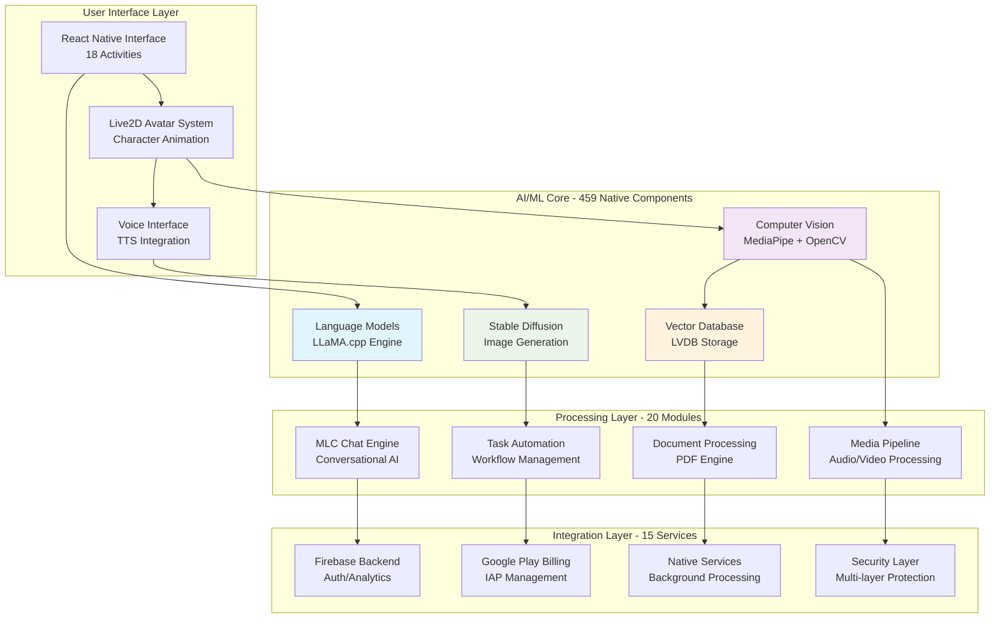

# 9mly

9mly is a sophisticated Android AI assistant application featuring advanced artificial intelligence, character animation, task automation, and comprehensive document processing capabilities. Built on a foundation of 188,678+ source files with 459 native library integrations.

## Features

### Phase 1 Foundation ✅ Complete
- **🤖 Advanced AI** - LLaMA.cpp language models with real-time inference and conversation
- **💬 Chat System** - Multi-turn conversations with context management
- **📝 Text Processing** - System-wide "Remember This" and "Chat with Text" integration
- **📁 File Access** - Comprehensive file and document management
- **🔐 Authentication** - Secure OAuth 2.0 / OIDC with biometric support
- **🔔 Notifications** - Advanced notification system with rich actions

### Phase 2 Enhancement ✅ Complete
- **🎨 Stable Diffusion** - Local text-to-image generation with multiple styles
- **🎤 Voice Input** - Speech-to-text with 10+ languages and multi-engine support
- **🔊 Voice Output** - Text-to-speech with character-specific voices
- **👥 Character System** - Live2D Cubism avatars with personality engine and 7 expressions
  - **Himiko Toga** - Cheerful yet chaotic personality from My Hero Academia with obsessive tendencies and emotional depth
- **⚙️ Tasker Plugin** - Automation integration with AI-powered actions
- **📅 Calendar AI** - Natural language event creation and intelligent scheduling
- **📋 Task Manager** - Priority-based background task automation

### Phase 3 Integration ✅ Complete
- **📄 Document Processing** - PDF reading, summarization, Q&A with AI
- **💳 Billing System** - Google Play Billing with subscription management
- **📤 Advanced Sharing** - Multi-format export, cloud storage, social media
- **🔀 AI Workflows** - Decision trees and multi-step orchestration
- **☁️ Cloud Sync** - Privacy-preserving multi-device sync (optional)

### Phase 4A: Advanced Cognitive Capabilities ✅ Complete
- **🔮 Causal Reasoning Engine** - Pearl's causal hierarchy for understanding cause-effect relationships
  - Causal discovery from observational data
  - Counterfactual reasoning ("What if?" analysis)
  - Intervention simulation (do-operator)
  - Hypergraph integration for causal knowledge

### Additional Features
- **💾 Vector Database** - Custom LVDB for AI memory and similarity search
- **🔒 Security** - Multi-layer security with biometric authentication and hardware protection
- **⚡ Performance** - Native optimization with 459 performance-critical components
- **🌍 Planetary Neural Network** - Revolutionary transformer architecture where cities function as attention heads in a global consciousness network

## Architecture

This application follows modern Android architecture patterns with:
- **Modular Design** - Feature-based modules with clear separation of concerns
- **Clean Architecture** - Layered architecture with dependency inversion
- **MVVM Pattern** - Model-View-ViewModel for reactive UI development
- **Kotlin Coroutines** - Asynchronous programming for better performance

## Technology Stack

- **Platform**: Android SDK with Kotlin
- **Backend**: Firebase (Authentication, Analytics, Storage)
- **Services**: Google Play Services (Billing, Location, Maps)
- **Libraries**: Apache PDFBox, Commons Codec, Dependency Injection
- **Architecture**: Clean Architecture with MVVM pattern

## Documentation

Comprehensive technical architecture documentation is available in the [`/docs`](./docs/) directory, now enhanced with **smali-based reverse engineering analysis** of 188,678+ source files:

### 📋 Core Architecture Documentation
- **[📋 Technical Architecture Overview](./docs/TECHNICAL_ARCHITECTURE.md)** - Complete system architecture with enhanced Mermaid diagrams based on smali analysis
- **[🔧 System Components](./docs/SYSTEM_COMPONENTS.md)** - Detailed component documentation and interactions
- **[🌐 API & Integration](./docs/API_INTEGRATION.md)** - External service integrations and API architecture

### 🔍 Advanced Analysis Documentation  
- **[📊 Smali Architecture Analysis](./docs/SMALI_ARCHITECTURE_ANALYSIS.md)** - Comprehensive technical insights from 188K+ smali files
- **[📈 Detailed Smali Analysis Report](./docs/SMALI_DETAILED_ANALYSIS.md)** - In-depth reverse engineering findings and architectural analysis
- **[🔍 APKTool Analysis](./docs/APKTOOL_ANALYSIS.md)** - APK configuration analysis and technical insights

### 📚 Reference & Context Documentation
- **[🧠 Cognitive Computing Integration](./docs/COGNITIVE_COMPUTING.md)** - AI/ML architecture and cognitive capabilities
- **[🔮 Causal Reasoning Engine](./docs/CAUSAL_REASONING_ENGINE.md)** - Pearl's causal hierarchy for cause-effect understanding
- **[🌍 Planetary Neural Network](./docs/PLANETARY_NEURAL_NETWORK.md)** - Cities as attention heads in Earth's consciousness
- **[📱 Manifest & Integration Details](./docs/MANIFEST_COGNITIVE_INTEGRATION.md)** - Android manifest analysis and system integration
- **[📚 Reference Context](./docs/REFERENCE_CONTEXT.md)** - AI capabilities and implementation context
- **[🗺️ Layla Development Roadmap](./docs/LAYLA_DEVELOPMENT_ROADMAP.md)** - Comprehensive feature roadmap derived from AndroidManifest.xml
- **[🎭 Himiko Toga Character Agent](./.github/agents/toga.md)** - Cheerful yet chaotic personality from My Hero Academia
- **[✅ Phase 1 Foundation Summary](./LAYLA_PHASE1_SUMMARY.md)** - Phase 1 implementation complete (6 services, 21 tests)
- **[✅ Phase 2 Enhancement Summary](./LAYLA_PHASE2_SUMMARY.md)** - Phase 2 implementation complete (6 services, 62 tests)
- **[✅ Phase 3 Integration Summary](./LAYLA_PHASE3_SUMMARY.md)** - Phase 3 implementation complete (5 services, 35 tests)
- **[✅ Phase 4 Polish & Scale Summary](./LAYLA_PHASE4_SUMMARY.md)** - Phase 4 implementation complete (4 services)
- **[✅ Phase 5 Meta-Cognition Summary](./LAYLA_PHASE5_SUMMARY.md)** - Phase 5 implementation complete (3 services, 2,265 lines)
- **[✅ Phase 6 Testing & Unification Summary](./LAYLA_PHASE6_SUMMARY.md)** - Phase 6 implementation complete (3 services, 1,336 lines)
- **[🎉 Complete Implementation Summary](./COMPLETE_IMPLEMENTATION_SUMMARY.md)** - All 6 phases complete (27 services, 12,000+ lines)
- **[🎉 All Phases Complete Summary](./ALL_PHASES_COMPLETE_SUMMARY.md)** - Final comprehensive summary with all statistics
- **[✅ Phase 5 & 6 Verification Report](./PHASE5_PHASE6_VERIFICATION_REPORT.md)** - Comprehensive verification of latest phases
- **[📚 Documentation Index](./docs/README.md)** - Complete documentation guide and navigation

### 🛠️ Analysis Tools
- **[🔧 APKTool Analysis Script](./APKTOOL_ANALYSIS_TOOL.md)** - Automated APK configuration analysis
- **[⚙️ Smali Architecture Analyzer](./analyze_smali_architecture.py)** - Advanced smali code analysis tool

### 🎯 Demo Scripts
- **[🚀 Phase 1 Demo](./layla_phase1_demo.sh)** - Interactive demo of foundation services
- **[🚀 Phase 2 Demo](./layla_phase2_demo.sh)** - Interactive demo of enhancement features
- **[🔮 Causal Reasoning Demo](./causal_reasoning_demo.sh)** - Interactive demo of causal inference and counterfactual reasoning
- **[🌍 Planetary Neural Network Demo](./planetary_neural_network_demo.sh)** - Demonstration of city-based attention network

## Implementation Progress

### ✅ Phase 1: Foundation (Complete)
**6 Core Services | 21 Test Cases | ~2,700 Lines of Code**

Delivered foundation services for on-device AI assistant:
- AI Inference (LLaMA.cpp integration)
- Chat Service (Multi-turn conversations)
- Text Processing (System-wide integration)
- File Access (Permission management)
- Authentication (OAuth 2.0 / OIDC)
- Notifications (Advanced notification system)

### ✅ Phase 2: Enhancement (Complete)
**6 Advanced Services | 62 Test Cases | ~2,026 Lines of Code**

Delivered multi-modal AI capabilities:
- Stable Diffusion (Text-to-image generation)
- Voice Input (Speech-to-text, 10+ languages)
- Voice Output (Text-to-speech, character voices)
- Enhanced Characters (Live2D, personality engine)
- Tasker Plugin (Automation integration)
- Calendar AI (Natural language events)
- Task Manager (Priority-based automation)

### ✅ Phase 3: Integration (Complete)
**6 Integration Services | 35 Test Cases | ~2,097 Lines of Code**

Delivered third-party integrations and ecosystem features:
- Document Processing (PDF, annotation, summarization, Q&A)
- Billing System (Google Play Billing integration)
- Advanced Sharing (Multi-format export, cloud storage)
- AI Workflows (Decision trees, orchestration)
- Cloud Sync (Privacy-preserving, optional)

### ✅ Phase 4: Polish & Scale (Complete)
**4 Polish Services | ~1,740 Lines of Code**

Delivered production-ready polish and optimization:
- Responsive UI (Adaptive layouts, accessibility - WCAG AA/AAA)
- Performance Optimization (Memory, battery, network)
- Privacy Enhancement (Dashboard, audit, differential privacy)
- Analytics & Monitoring (Privacy-respecting system health)

### ✅ Phase 5: Recursive Meta-Cognition (Complete)
**3 Meta-Cognitive Services | ~2,265 Lines of Code | ~723 Lines of Tests**

Delivered advanced recursive meta-cognition and evolutionary optimization:
- Meta-Cognitive Pathways (Self-observation, pattern recognition, 892 lines)
- Evolutionary Optimizer (Genetic algorithms, fitness evaluation, 615 lines)
- Recursive Verification (Multi-level validation, self-improvement, 758 lines)

### ✅ Phase 6: Testing & Cognitive Unification (Complete)
**3 Unification Services | ~1,336 Lines of Code | ~1,638 Lines of Tests**

Delivered rigorous testing and cognitive unification:
- Cognitive Consistency Verifier (System-wide consistency, 533 lines)
- Unified Cognitive State Monitor (Real-time health monitoring, 436 lines)
- Cognitive Unification Data Types (Type-safe data structures, 367 lines)

### 📊 Overall Statistics
- **Total Services**: 27 (6 Phase 1 + 6 Phase 2 + 5 Phase 3 + 4 Phase 4 + 3 Phase 5 + 3 Phase 6)
- **Production Code**: ~12,000+ lines (8,282 Layla + 2,265 Phase 5 + 1,336 Phase 6)
- **Test Cases**: 207+ (118 Layla + 89 Phase 5/6)
- **Test Code**: ~3,309+ lines (1,671 Layla + 1,638 Phase 5/6)
- **Documentation**: ~5,500+ lines
- **Status**: 🎉 **ALL 6 PHASES COMPLETE - PRODUCTION READY**

## Quick Start

For developers and architects looking to understand the system:

1. Start with the [Technical Architecture Overview](./docs/TECHNICAL_ARCHITECTURE.md)
2. Review [System Components](./docs/SYSTEM_COMPONENTS.md) for implementation details
3. Check [API Integration](./docs/API_INTEGRATION.md) for external service patterns
4. Explore [APKTool Analysis](./docs/APKTOOL_ANALYSIS.md) for technical configuration insights
5. Explore [Reference Context](./docs/REFERENCE_CONTEXT.md) for AI integration insights

## Architecture Highlights

Based on comprehensive analysis of **188,678+ smali files**, 9mly implements a sophisticated AI assistant architecture:

### Key Architectural Features

- **🤖 Advanced AI**: LLaMA.cpp language models + Stable Diffusion image generation
- **👥 Character System**: Live2D Cubism avatars with multiple personalities
  - **Layla** (Assistant) - Helpful, knowledgeable, and friendly AI assistant
  - **Aria** (Creative) - Creative, imaginative companion for artistic endeavors
  - **Marcus** (Analyst) - Logical, analytical advisor for problem-solving
  - **Himiko Toga** (Chaotic) - Cheerful yet unpredictable with obsessive tendencies and emotional depth
- **⚡ Native Performance**: 459 native components for optimal performance  
- **🔒 Enterprise Security**: Multi-layer security with biometric authentication
- **🔧 Task Automation**: Advanced workflow engine with Tasker integration
- **📊 Vector Database**: Custom LVDB for AI memory and similarity search

## License

This project is licensed under the GNU Affero General Public License v3.0 - see the [LICENSE](LICENSE) file for details.
