# API and Integration Architecture

This document outlines the API architecture and external integrations for the 9mly Android application.

## API Architecture Overview

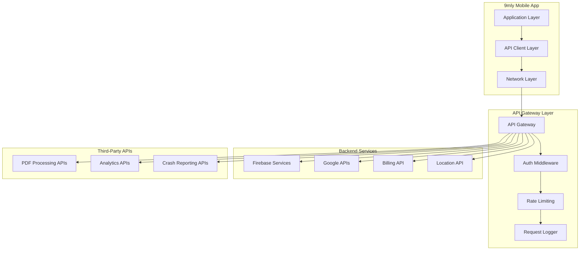

## Integration Patterns

### Firebase Integration

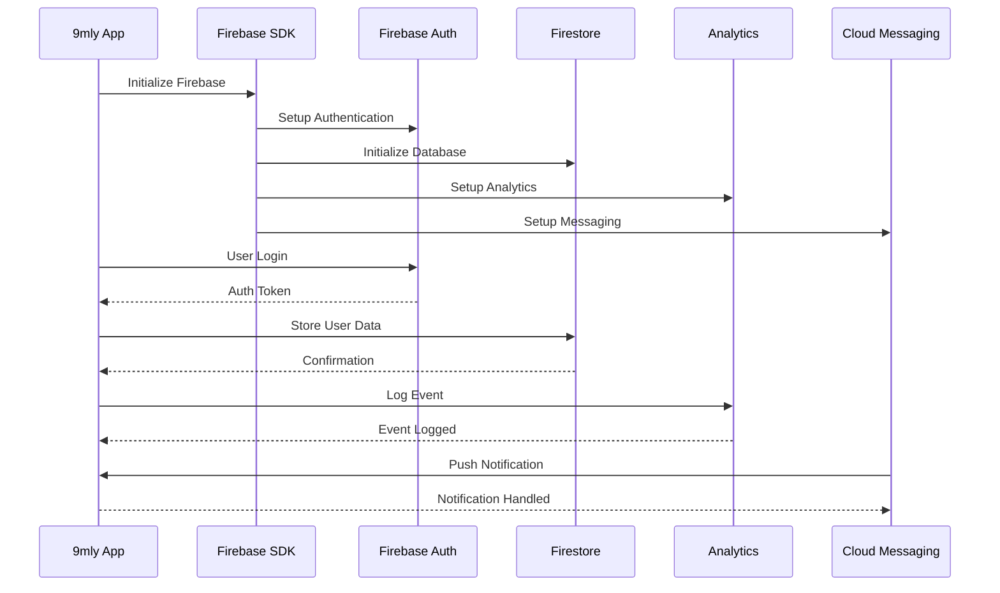

### Google Play Services Integration

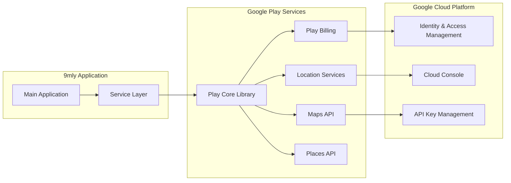

## API Specifications

### Authentication API Flow

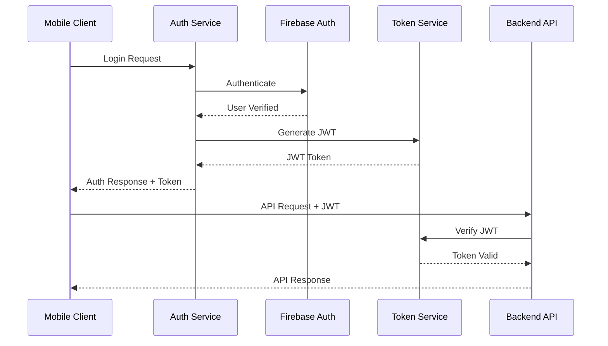

### Billing API Integration

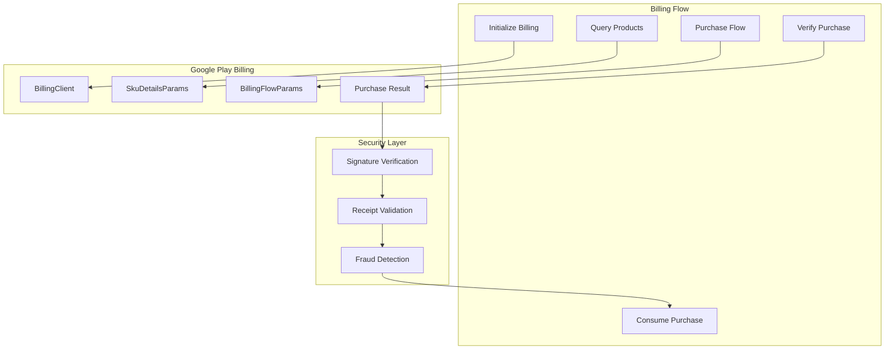

### Location Services API

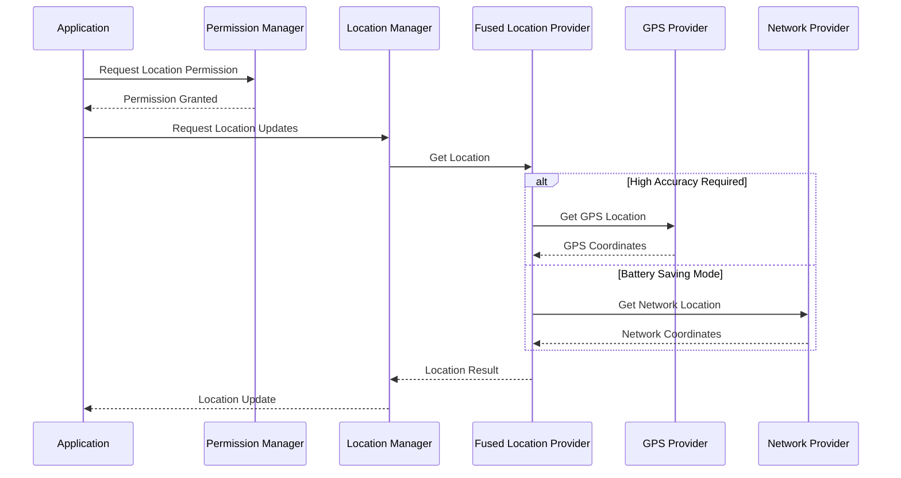

## External API Integrations

### PDF Processing API Integration

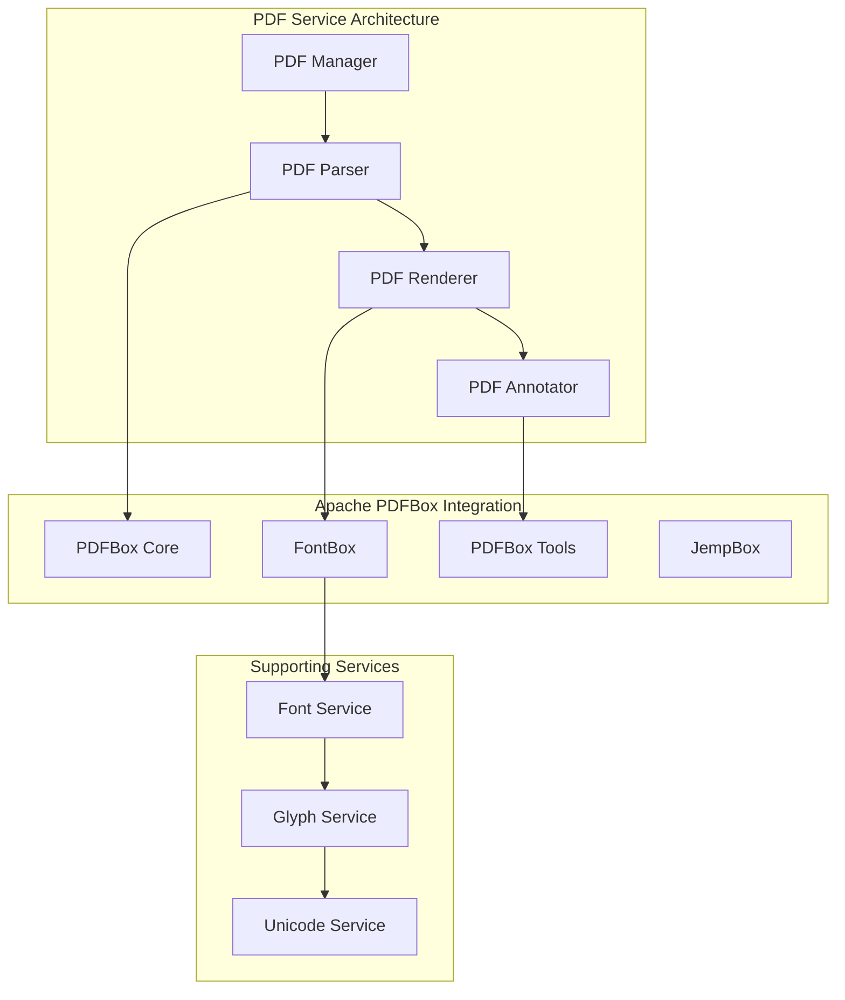

### Analytics and Monitoring APIs

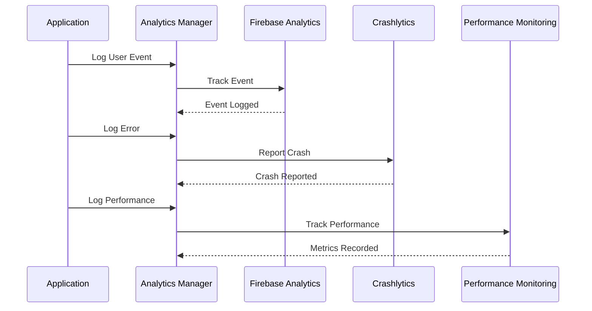

### AI Processing API Integration

The application incorporates on-device AI processing capabilities that align with reference implementations for private, local AI computation.

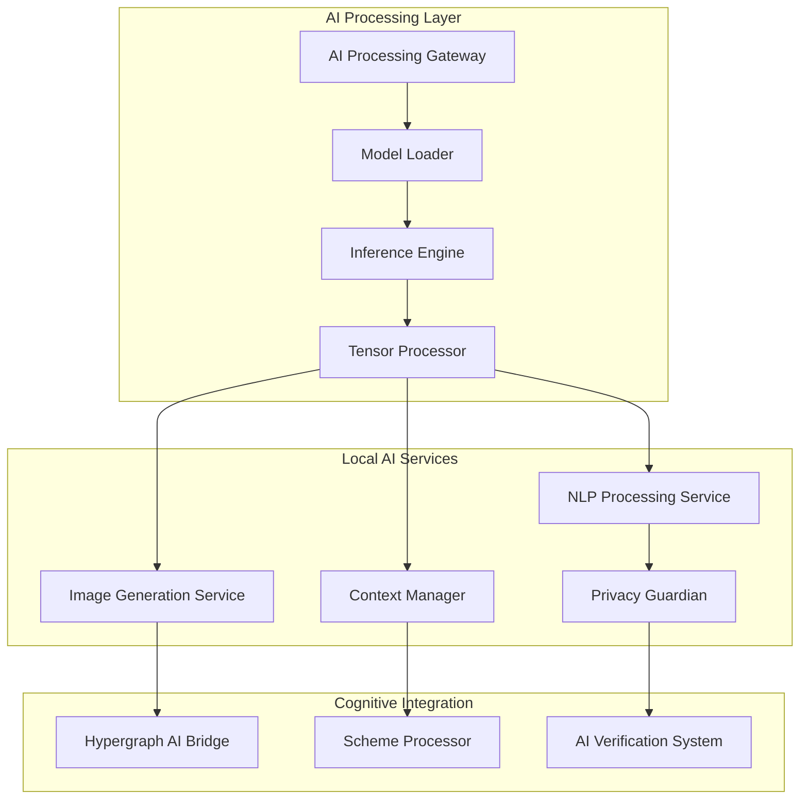

**Key AI Integration Patterns:**
- **Local Processing Only**: All AI computations remain on-device for privacy
- **Context-Aware Processing**: AI adapts to user patterns and preferences
- **Multi-Modal Integration**: Support for text, image, and conversational AI
- **Privacy-First Architecture**: No external AI API calls, complete data isolation

## API Security and Authentication

### Security Architecture

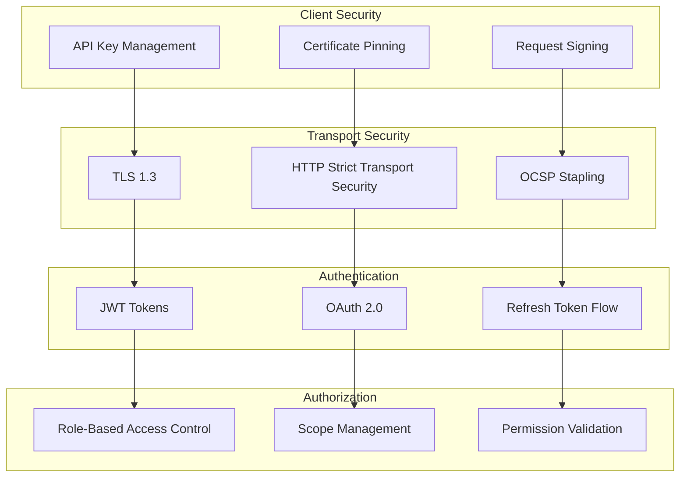

### Token Management Flow

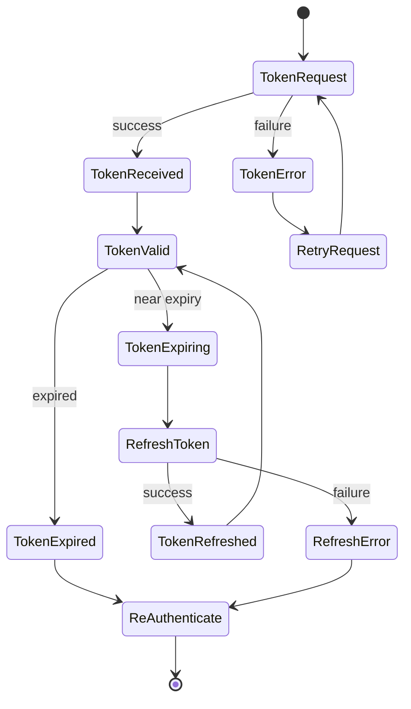

## API Rate Limiting and Throttling

### Rate Limiting Strategy

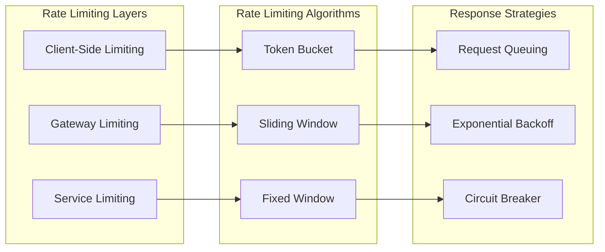

## API Documentation Standards

### API Endpoint Documentation

| Service | Endpoint | Method | Purpose | Authentication |
|---------|----------|--------|---------|----------------|
| **Firebase Auth** | `/auth/login` | POST | User authentication | API Key |
| **Firebase Firestore** | `/firestore/users/{id}` | GET/PUT | User data management | JWT Token |
| **Play Billing** | `/billing/purchase` | POST | Process purchase | OAuth 2.0 |
| **Location Services** | `/location/current` | GET | Get current location | App Signature |
| **Analytics** | `/analytics/event` | POST | Log analytics event | API Key |

### Error Response Format

```json
{
  "error": {
    "code": "AUTHENTICATION_FAILED",
    "message": "Invalid authentication credentials",
    "details": {
      "timestamp": "2024-01-01T00:00:00Z",
      "requestId": "req_123456789",
      "suggestions": [
        "Check API key validity",
        "Ensure proper authentication headers"
      ]
    }
  }
}
```

### Success Response Format

```json
{
  "data": {
    "id": "user_123",
    "status": "success",
    "timestamp": "2024-01-01T00:00:00Z"
  },
  "meta": {
    "requestId": "req_123456789",
    "version": "v1.0",
    "rateLimit": {
      "remaining": 99,
      "resetTime": "2024-01-01T00:01:00Z"
    }
  }
}
```

## Integration Testing Strategy

### API Testing Architecture

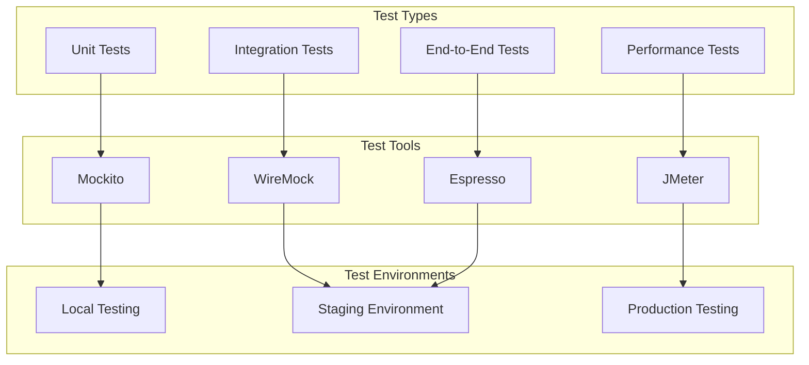

---

*This document provides comprehensive coverage of the API and integration architecture for the 9mly application.*