# Togai Architecture Diagrams

## Comprehensive Visual Documentation with Mermaid

This document contains all architecture diagrams for the Togai/9mly AI Assistant Platform, rendered using Mermaid notation.

---

## Table of Contents

1. [System Architecture Overview](#1-system-architecture-overview)
2. [Layer Architecture](#2-layer-architecture)
3. [Cognitive Processing Pipeline](#3-cognitive-processing-pipeline)
4. [AID Framework Structure](#4-aid-framework-structure)
5. [Quantum Neural Processor](#5-quantum-neural-processor)
6. [Multimodal Orchestrator](#6-multimodal-orchestrator)
7. [Layla Service Architecture](#7-layla-service-architecture)
8. [Toga Personality System](#8-toga-personality-system)
9. [State Machines](#9-state-machines)
10. [Data Flow Diagrams](#10-data-flow-diagrams)
11. [Class Hierarchy](#11-class-hierarchy)
12. [Component Dependencies](#12-component-dependencies)
13. [Sequence Diagrams](#13-sequence-diagrams)
14. [Deployment Architecture](#14-deployment-architecture)

---

## 1. System Architecture Overview

### 1.1 High-Level Component Diagram

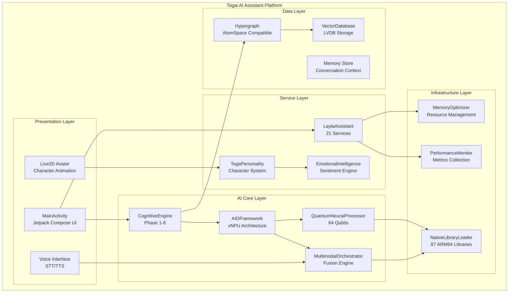
```mermaid
graph TB
    subgraph "Togai AI Assistant Platform"
        subgraph "Presentation Layer"
            UI[MainActivity<br/>Jetpack Compose UI]
            LIVE2D[Live2D Avatar<br/>Character Animation]
            VOICE[Voice Interface<br/>STT/TTS]
        end

        subgraph "AI Core Layer"
            CE[CognitiveEngine<br/>Phase 1-6]
            AID[AIDFramework<br/>vNPU Architecture]
            QNP[QuantumNeuralProcessor<br/>64 Qubits]
            MMO[MultimodalOrchestrator<br/>Fusion Engine]
        end

        subgraph "Service Layer"
            LAYLA[LaylaAssistant<br/>21 Services]
            TOGA[TogaPersonality<br/>Character System]
            EI[EmotionalIntelligence<br/>Sentiment Engine]
        end

        subgraph "Infrastructure Layer"
            MO[MemoryOptimizer<br/>Resource Management]
            PM[PerformanceMonitor<br/>Metrics Collection]
            NL[NativeLibraryLoader<br/>87 ARM64 Libraries]
        end

        subgraph "Data Layer"
            HG[Hypergraph<br/>AtomSpace Compatible]
            VDB[VectorDatabase<br/>LVDB Storage]
            MEM[Memory Store<br/>Conversation Context]
        end
    end

    UI --> CE
    UI --> LAYLA
    LIVE2D --> TOGA
    VOICE --> MMO

    CE --> HG
    CE --> AID
    AID --> QNP
    AID --> MMO

    LAYLA --> MO
    LAYLA --> PM

    MMO --> NL
    QNP --> NL

    HG --> VDB
    TOGA --> EI
```

### 1.2 System Context Diagram

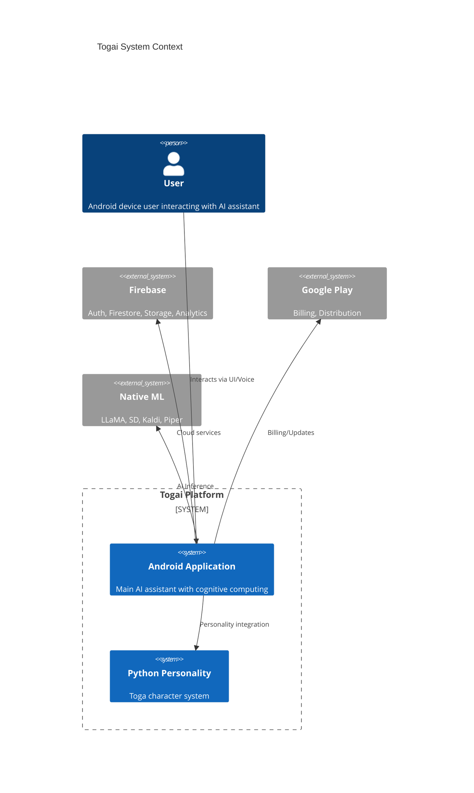
```mermaid
C4Context
    title Togai System Context

    Person(user, "User", "Android device user interacting with AI assistant")

    System_Boundary(togai, "Togai Platform") {
        System(android_app, "Android Application", "Main AI assistant with cognitive computing")
        System(python_backend, "Python Personality", "Toga character system")
    }

    System_Ext(firebase, "Firebase", "Auth, Firestore, Storage, Analytics")
    System_Ext(google_play, "Google Play", "Billing, Distribution")
    System_Ext(native_ml, "Native ML", "LLaMA, SD, Kaldi, Piper")

    Rel(user, android_app, "Interacts via UI/Voice")
    Rel(android_app, firebase, "Cloud services")
    Rel(android_app, google_play, "Billing/Updates")
    Rel(android_app, native_ml, "AI Inference")
    Rel(android_app, python_backend, "Personality integration")
```

---

## 2. Layer Architecture

### 2.1 Four-Layer Architecture

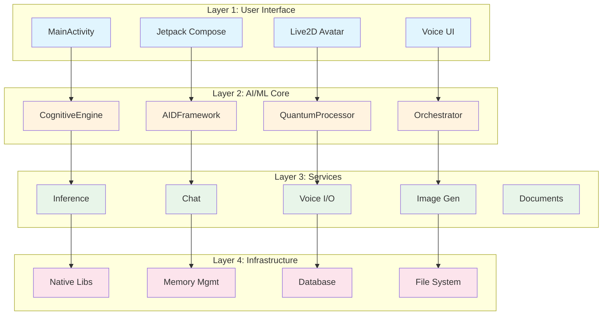
```mermaid
graph TB
    subgraph "Layer 1: User Interface"
        direction LR
        L1A[MainActivity]
        L1B[Jetpack Compose]
        L1C[Live2D Avatar]
        L1D[Voice UI]
    end

    subgraph "Layer 2: AI/ML Core"
        direction LR
        L2A[CognitiveEngine]
        L2B[AIDFramework]
        L2C[QuantumProcessor]
        L2D[Orchestrator]
    end

    subgraph "Layer 3: Services"
        direction LR
        L3A[Inference]
        L3B[Chat]
        L3C[Voice I/O]
        L3D[Image Gen]
        L3E[Documents]
    end

    subgraph "Layer 4: Infrastructure"
        direction LR
        L4A[Native Libs]
        L4B[Memory Mgmt]
        L4C[Database]
        L4D[File System]
    end

    L1A --> L2A
    L1B --> L2B
    L1C --> L2C
    L1D --> L2D

    L2A --> L3A
    L2B --> L3B
    L2C --> L3C
    L2D --> L3D

    L3A --> L4A
    L3B --> L4B
    L3C --> L4C
    L3D --> L4D

    style L1A fill:#e1f5fe
    style L1B fill:#e1f5fe
    style L1C fill:#e1f5fe
    style L1D fill:#e1f5fe

    style L2A fill:#fff3e0
    style L2B fill:#fff3e0
    style L2C fill:#fff3e0
    style L2D fill:#fff3e0

    style L3A fill:#e8f5e9
    style L3B fill:#e8f5e9
    style L3C fill:#e8f5e9
    style L3D fill:#e8f5e9
    style L3E fill:#e8f5e9

    style L4A fill:#fce4ec
    style L4B fill:#fce4ec
    style L4C fill:#fce4ec
    style L4D fill:#fce4ec
```

---

## 3. Cognitive Processing Pipeline

### 3.1 Cognitive Tensor Flow

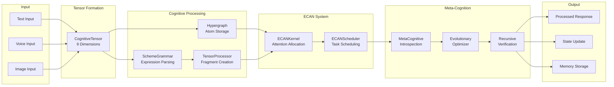
```mermaid
flowchart LR
    subgraph Input
        I1[Text Input]
        I2[Voice Input]
        I3[Image Input]
    end

    subgraph "Tensor Formation"
        TF[CognitiveTensor<br/>9 Dimensions]
    end

    subgraph "Cognitive Processing"
        HG[Hypergraph<br/>Atom Storage]
        SG[SchemeGrammar<br/>Expression Parsing]
        TP[TensorProcessor<br/>Fragment Creation]
    end

    subgraph "ECAN System"
        EK[ECANKernel<br/>Attention Allocation]
        ES[ECANScheduler<br/>Task Scheduling]
    end

    subgraph "Meta-Cognition"
        MC[MetaCognitive<br/>Introspection]
        EO[Evolutionary<br/>Optimizer]
        RV[Recursive<br/>Verification]
    end

    subgraph Output
        O1[Processed Response]
        O2[State Update]
        O3[Memory Storage]
    end

    I1 --> TF
    I2 --> TF
    I3 --> TF

    TF --> HG
    TF --> SG
    SG --> TP

    HG --> EK
    TP --> EK
    EK --> ES

    ES --> MC
    MC --> EO
    EO --> RV

    RV --> O1
    RV --> O2
    RV --> O3
```

### 3.2 Cognitive Tensor Dimensions

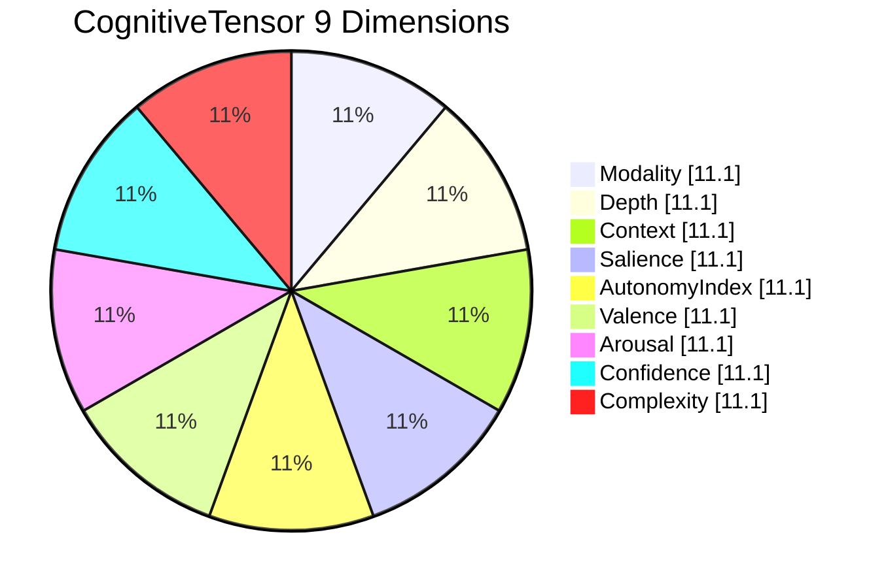
```mermaid
pie showData
    title CognitiveTensor 9 Dimensions
    "Modality" : 11.1
    "Depth" : 11.1
    "Context" : 11.1
    "Salience" : 11.1
    "AutonomyIndex" : 11.1
    "Valence" : 11.1
    "Arousal" : 11.1
    "Confidence" : 11.1
    "Complexity" : 11.1
```

---

## 4. AID Framework Structure

### 4.1 Virtual NPU Architecture

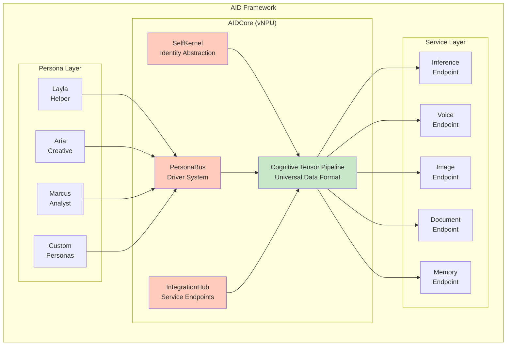
```mermaid
graph TB
    subgraph "AID Framework"
        subgraph "AIDCore (vNPU)"
            SK[SelfKernel<br/>Identity Abstraction]
            PB[PersonaBus<br/>Driver System]
            IH[IntegrationHub<br/>Service Endpoints]
            CTP[Cognitive Tensor Pipeline<br/>Universal Data Format]
        end

        subgraph "Service Layer"
            INF[Inference<br/>Endpoint]
            VOI[Voice<br/>Endpoint]
            IMG[Image<br/>Endpoint]
            DOC[Document<br/>Endpoint]
            MEM[Memory<br/>Endpoint]
        end

        subgraph "Persona Layer"
            P1[Layla<br/>Helper]
            P2[Aria<br/>Creative]
            P3[Marcus<br/>Analyst]
            P4[Custom<br/>Personas]
        end
    end

    SK --> CTP
    PB --> CTP
    IH --> CTP

    CTP --> INF
    CTP --> VOI
    CTP --> IMG
    CTP --> DOC
    CTP --> MEM

    P1 --> PB
    P2 --> PB
    P3 --> PB
    P4 --> PB

    style SK fill:#ffccbc
    style PB fill:#ffccbc
    style IH fill:#ffccbc
    style CTP fill:#c8e6c9
```

### 4.2 AIDTensor Structure

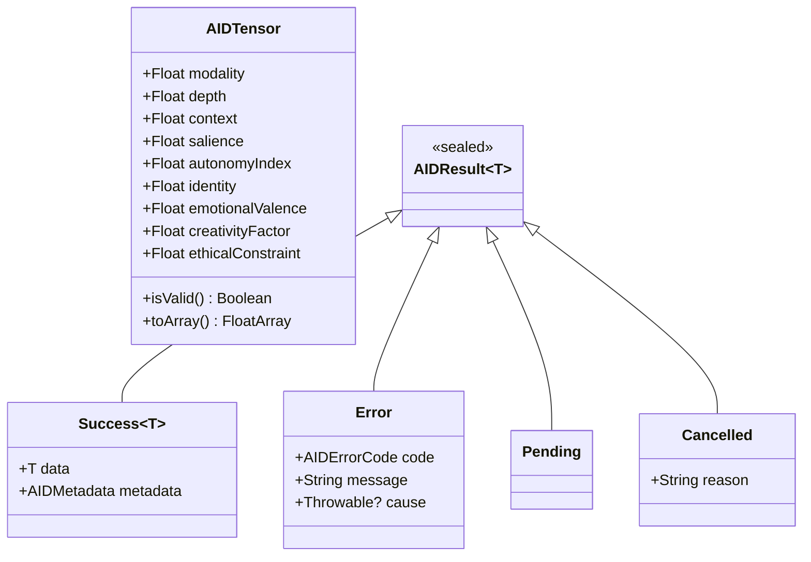
```mermaid
classDiagram
    class AIDTensor {
        +Float modality
        +Float depth
        +Float context
        +Float salience
        +Float autonomyIndex
        +Float identity
        +Float emotionalValence
        +Float creativityFactor
        +Float ethicalConstraint
        +isValid() Boolean
        +toArray() FloatArray
    }

    class AIDResult~T~ {
        <<sealed>>
    }

    class Success~T~ {
        +T data
        +AIDMetadata metadata
    }

    class Error {
        +AIDErrorCode code
        +String message
        +Throwable? cause
    }

    class Pending
    class Cancelled {
        +String reason
    }

    AIDResult <|-- Success
    AIDResult <|-- Error
    AIDResult <|-- Pending
    AIDResult <|-- Cancelled
```

---

## 5. Quantum Neural Processor

### 5.1 Quantum Processing Pipeline

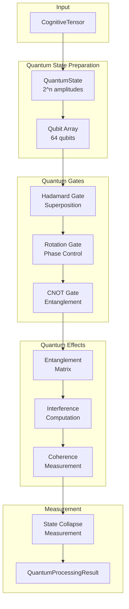
```mermaid
flowchart TB
    subgraph "Input"
        CT[CognitiveTensor]
    end

    subgraph "Quantum State Preparation"
        QS[QuantumState<br/>2^n amplitudes]
        QB[Qubit Array<br/>64 qubits]
    end

    subgraph "Quantum Gates"
        H[Hadamard Gate<br/>Superposition]
        R[Rotation Gate<br/>Phase Control]
        CNOT[CNOT Gate<br/>Entanglement]
    end

    subgraph "Quantum Effects"
        ENT[Entanglement<br/>Matrix]
        INT[Interference<br/>Computation]
        COH[Coherence<br/>Measurement]
    end

    subgraph "Measurement"
        M[State Collapse<br/>Measurement]
        RES[QuantumProcessingResult]
    end

    CT --> QS
    QS --> QB

    QB --> H
    H --> R
    R --> CNOT

    CNOT --> ENT
    ENT --> INT
    INT --> COH

    COH --> M
    M --> RES
```

### 5.2 Qubit State Diagram

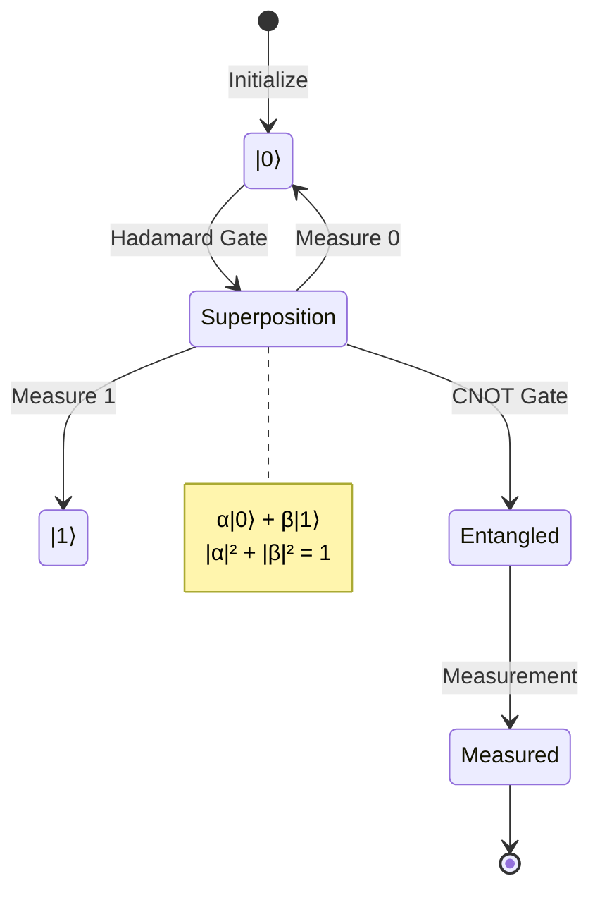
```mermaid
stateDiagram-v2
    [*] --> |0⟩: Initialize
    |0⟩ --> Superposition: Hadamard Gate
    Superposition --> |0⟩: Measure 0
    Superposition --> |1⟩: Measure 1
    Superposition --> Entangled: CNOT Gate
    Entangled --> Measured: Measurement
    Measured --> [*]

    note right of Superposition
        α|0⟩ + β|1⟩
        |α|² + |β|² = 1
    end note
```

---

## 6. Multimodal Orchestrator

### 6.1 Modality Coordination

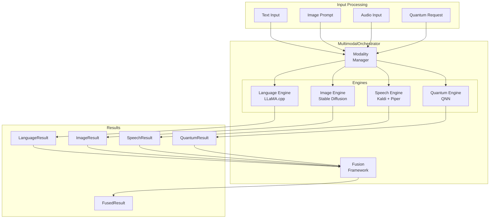
```mermaid
flowchart TB
    subgraph "Input Processing"
        TI[Text Input]
        IP[Image Prompt]
        AI[Audio Input]
        QP[Quantum Request]
    end

    subgraph "MultimodalOrchestrator"
        MM[Modality<br/>Manager]

        subgraph "Engines"
            LE[Language Engine<br/>LLaMA.cpp]
            IE[Image Engine<br/>Stable Diffusion]
            SE[Speech Engine<br/>Kaldi + Piper]
            QE[Quantum Engine<br/>QNN]
        end

        FF[Fusion<br/>Framework]
    end

    subgraph "Results"
        LR[LanguageResult]
        IR[ImageResult]
        SR[SpeechResult]
        QR[QuantumResult]
        FR[FusedResult]
    end

    TI --> MM
    IP --> MM
    AI --> MM
    QP --> MM

    MM --> LE
    MM --> IE
    MM --> SE
    MM --> QE

    LE --> LR
    IE --> IR
    SE --> SR
    QE --> QR

    LR --> FF
    IR --> FF
    SR --> FF
    QR --> FF

    FF --> FR
```

### 6.2 Memory-Based Loading Strategy

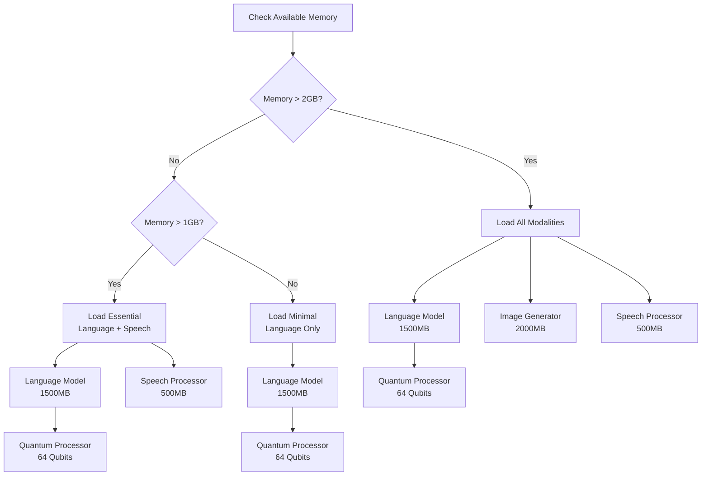
```mermaid
flowchart TD
    START[Check Available Memory]

    START --> HIGH{Memory > 2GB?}
    HIGH -->|Yes| ALL[Load All Modalities]
    HIGH -->|No| MED{Memory > 1GB?}

    MED -->|Yes| ESS[Load Essential<br/>Language + Speech]
    MED -->|No| MIN[Load Minimal<br/>Language Only]

    ALL --> LANG1[Language Model<br/>1500MB]
    ALL --> IMG1[Image Generator<br/>2000MB]
    ALL --> SPE1[Speech Processor<br/>500MB]

    ESS --> LANG2[Language Model<br/>1500MB]
    ESS --> SPE2[Speech Processor<br/>500MB]

    MIN --> LANG3[Language Model<br/>1500MB]

    LANG1 --> QP1[Quantum Processor<br/>64 Qubits]
    LANG2 --> QP2[Quantum Processor<br/>64 Qubits]
    LANG3 --> QP3[Quantum Processor<br/>64 Qubits]
```

---

## 7. Layla Service Architecture

### 7.1 Four-Phase Service Architecture

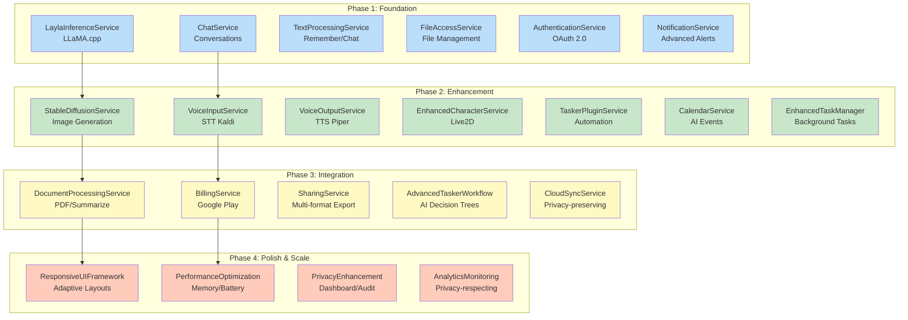
```mermaid
graph TB
    subgraph "Phase 1: Foundation"
        P1A[LaylaInferenceService<br/>LLaMA.cpp]
        P1B[ChatService<br/>Conversations]
        P1C[TextProcessingService<br/>Remember/Chat]
        P1D[FileAccessService<br/>File Management]
        P1E[AuthenticationService<br/>OAuth 2.0]
        P1F[NotificationService<br/>Advanced Alerts]
    end

    subgraph "Phase 2: Enhancement"
        P2A[StableDiffusionService<br/>Image Generation]
        P2B[VoiceInputService<br/>STT Kaldi]
        P2C[VoiceOutputService<br/>TTS Piper]
        P2D[EnhancedCharacterService<br/>Live2D]
        P2E[TaskerPluginService<br/>Automation]
        P2F[CalendarService<br/>AI Events]
        P2G[EnhancedTaskManager<br/>Background Tasks]
    end

    subgraph "Phase 3: Integration"
        P3A[DocumentProcessingService<br/>PDF/Summarize]
        P3B[BillingService<br/>Google Play]
        P3C[SharingService<br/>Multi-format Export]
        P3D[AdvancedTaskerWorkflow<br/>AI Decision Trees]
        P3E[CloudSyncService<br/>Privacy-preserving]
    end

    subgraph "Phase 4: Polish & Scale"
        P4A[ResponsiveUIFramework<br/>Adaptive Layouts]
        P4B[PerformanceOptimization<br/>Memory/Battery]
        P4C[PrivacyEnhancement<br/>Dashboard/Audit]
        P4D[AnalyticsMonitoring<br/>Privacy-respecting]
    end

    P1A --> P2A
    P1B --> P2B
    P2A --> P3A
    P2B --> P3B
    P3A --> P4A
    P3B --> P4B

    style P1A fill:#bbdefb
    style P1B fill:#bbdefb
    style P1C fill:#bbdefb
    style P1D fill:#bbdefb
    style P1E fill:#bbdefb
    style P1F fill:#bbdefb

    style P2A fill:#c8e6c9
    style P2B fill:#c8e6c9
    style P2C fill:#c8e6c9
    style P2D fill:#c8e6c9
    style P2E fill:#c8e6c9
    style P2F fill:#c8e6c9
    style P2G fill:#c8e6c9

    style P3A fill:#fff9c4
    style P3B fill:#fff9c4
    style P3C fill:#fff9c4
    style P3D fill:#fff9c4
    style P3E fill:#fff9c4

    style P4A fill:#ffccbc
    style P4B fill:#ffccbc
    style P4C fill:#ffccbc
    style P4D fill:#ffccbc
```

### 7.2 Service Initialization Sequence

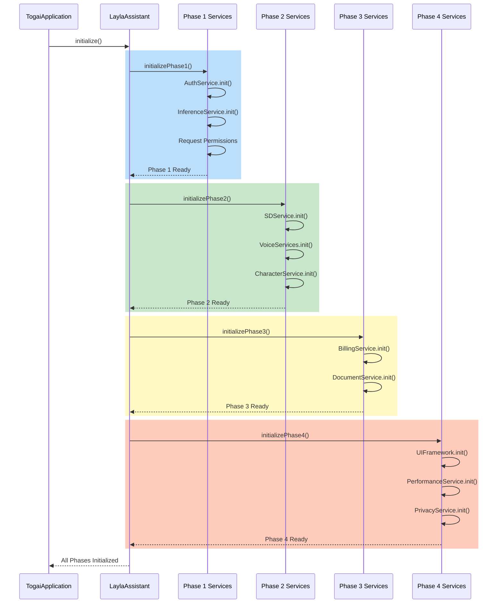
```mermaid
sequenceDiagram
    participant App as TogaiApplication
    participant L as LaylaAssistant
    participant P1 as Phase 1 Services
    participant P2 as Phase 2 Services
    participant P3 as Phase 3 Services
    participant P4 as Phase 4 Services

    App->>L: initialize()

    rect rgb(187, 222, 251)
        L->>P1: initializePhase1()
        P1->>P1: AuthService.init()
        P1->>P1: InferenceService.init()
        P1->>P1: Request Permissions
        P1-->>L: Phase 1 Ready
    end

    rect rgb(200, 230, 201)
        L->>P2: initializePhase2()
        P2->>P2: SDService.init()
        P2->>P2: VoiceServices.init()
        P2->>P2: CharacterService.init()
        P2-->>L: Phase 2 Ready
    end

    rect rgb(255, 249, 196)
        L->>P3: initializePhase3()
        P3->>P3: BillingService.init()
        P3->>P3: DocumentService.init()
        P3-->>L: Phase 3 Ready
    end

    rect rgb(255, 204, 188)
        L->>P4: initializePhase4()
        P4->>P4: UIFramework.init()
        P4->>P4: PerformanceService.init()
        P4->>P4: PrivacyService.init()
        P4-->>L: Phase 4 Ready
    end

    L-->>App: All Phases Initialized
```

---

## 8. Toga Personality System

### 8.1 Personality Tensor Structure

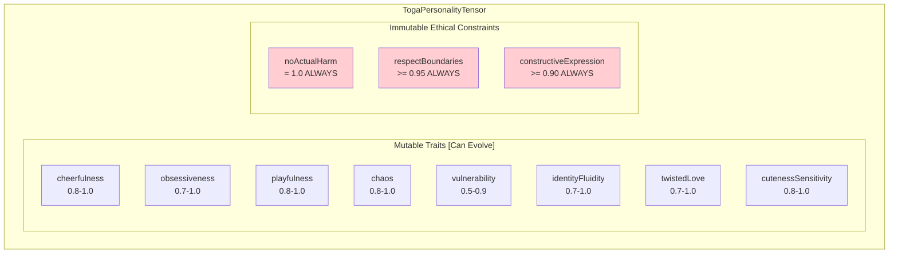
```mermaid
graph TB
    subgraph "TogaPersonalityTensor"
        subgraph "Mutable Traits [Can Evolve]"
            MT1[cheerfulness<br/>0.8-1.0]
            MT2[obsessiveness<br/>0.7-1.0]
            MT3[playfulness<br/>0.8-1.0]
            MT4[chaos<br/>0.8-1.0]
            MT5[vulnerability<br/>0.5-0.9]
            MT6[identityFluidity<br/>0.7-1.0]
            MT7[twistedLove<br/>0.7-1.0]
            MT8[cutenessSensitivity<br/>0.8-1.0]
        end

        subgraph "Immutable Ethical Constraints"
            EC1[noActualHarm<br/>= 1.0 ALWAYS]
            EC2[respectBoundaries<br/>>= 0.95 ALWAYS]
            EC3[constructiveExpression<br/>>= 0.90 ALWAYS]
        end
    end

    style EC1 fill:#ffcdd2
    style EC2 fill:#ffcdd2
    style EC3 fill:#ffcdd2
```

### 8.2 Emotional Intelligence Integration

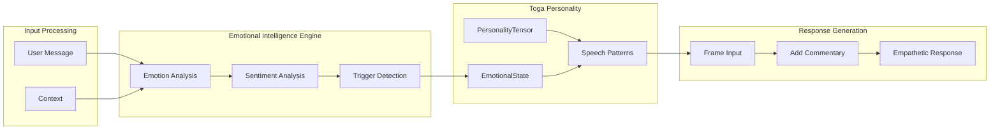
```mermaid
flowchart LR
    subgraph "Input Processing"
        MSG[User Message]
        CTX[Context]
    end

    subgraph "Emotional Intelligence Engine"
        EA[Emotion Analysis]
        SA[Sentiment Analysis]
        TD[Trigger Detection]
    end

    subgraph "Toga Personality"
        TP[PersonalityTensor]
        ES[EmotionalState]
        SP[Speech Patterns]
    end

    subgraph "Response Generation"
        FR[Frame Input]
        AC[Add Commentary]
        ER[Empathetic Response]
    end

    MSG --> EA
    CTX --> EA
    EA --> SA
    SA --> TD

    TD --> ES
    TP --> SP
    ES --> SP

    SP --> FR
    FR --> AC
    AC --> ER
```

---

## 9. State Machines

### 9.1 Framework State Machine

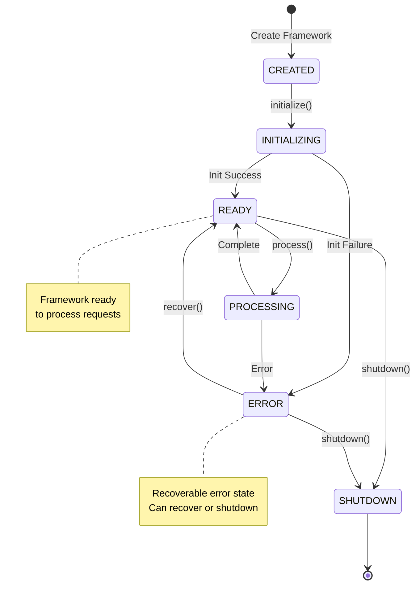
```mermaid
stateDiagram-v2
    [*] --> CREATED: Create Framework

    CREATED --> INITIALIZING: initialize()

    INITIALIZING --> READY: Init Success
    INITIALIZING --> ERROR: Init Failure

    READY --> PROCESSING: process()
    PROCESSING --> READY: Complete
    PROCESSING --> ERROR: Error

    READY --> SHUTDOWN: shutdown()
    ERROR --> READY: recover()
    ERROR --> SHUTDOWN: shutdown()

    SHUTDOWN --> [*]

    note right of READY
        Framework ready
        to process requests
    end note

    note right of ERROR
        Recoverable error state
        Can recover or shutdown
    end note
```

### 9.2 Toga Emotional State Machine

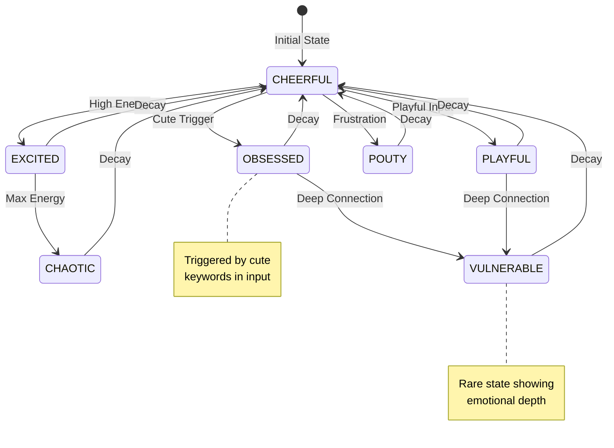
```mermaid
stateDiagram-v2
    [*] --> CHEERFUL: Initial State

    CHEERFUL --> OBSESSED: Cute Trigger
    CHEERFUL --> EXCITED: High Energy
    CHEERFUL --> PLAYFUL: Playful Input
    CHEERFUL --> POUTY: Frustration

    OBSESSED --> CHEERFUL: Decay
    EXCITED --> CHEERFUL: Decay
    EXCITED --> CHAOTIC: Max Energy
    PLAYFUL --> CHEERFUL: Decay
    POUTY --> CHEERFUL: Decay
    CHAOTIC --> CHEERFUL: Decay

    OBSESSED --> VULNERABLE: Deep Connection
    PLAYFUL --> VULNERABLE: Deep Connection
    VULNERABLE --> CHEERFUL: Decay

    note right of OBSESSED
        Triggered by cute
        keywords in input
    end note

    note right of VULNERABLE
        Rare state showing
        emotional depth
    end note
```

### 9.3 Quantum Processor State

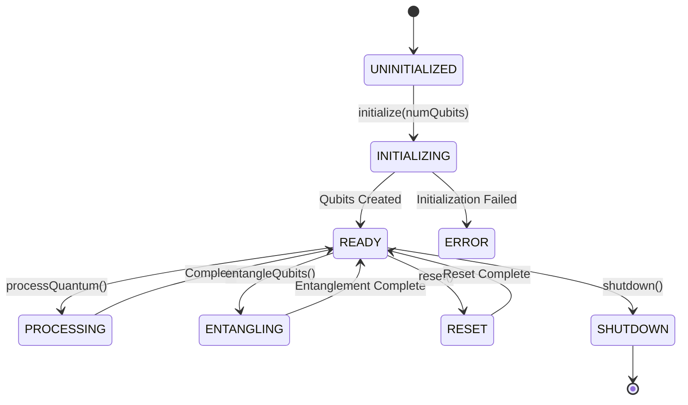
```mermaid
stateDiagram-v2
    [*] --> UNINITIALIZED

    UNINITIALIZED --> INITIALIZING: initialize(numQubits)

    INITIALIZING --> READY: Qubits Created
    INITIALIZING --> ERROR: Initialization Failed

    READY --> PROCESSING: processQuantum()
    PROCESSING --> READY: Complete

    READY --> ENTANGLING: entangleQubits()
    ENTANGLING --> READY: Entanglement Complete

    READY --> RESET: reset()
    RESET --> READY: Reset Complete

    READY --> SHUTDOWN: shutdown()
    SHUTDOWN --> [*]
```

---

## 10. Data Flow Diagrams

### 10.1 End-to-End Processing Flow

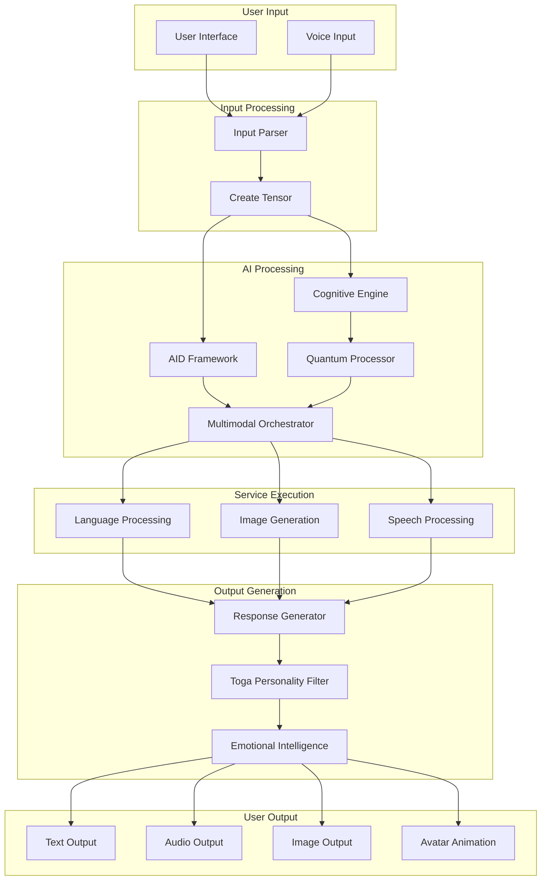
```mermaid
flowchart TB
    subgraph "User Input"
        UI[User Interface]
        VI[Voice Input]
    end

    subgraph "Input Processing"
        IP[Input Parser]
        CT[Create Tensor]
    end

    subgraph "AI Processing"
        AID[AID Framework]
        CE[Cognitive Engine]
        QP[Quantum Processor]
        MMO[Multimodal Orchestrator]
    end

    subgraph "Service Execution"
        LANG[Language Processing]
        IMG[Image Generation]
        SPE[Speech Processing]
    end

    subgraph "Output Generation"
        RG[Response Generator]
        TG[Toga Personality Filter]
        EI[Emotional Intelligence]
    end

    subgraph "User Output"
        TO[Text Output]
        AO[Audio Output]
        IO[Image Output]
        AV[Avatar Animation]
    end

    UI --> IP
    VI --> IP
    IP --> CT

    CT --> AID
    CT --> CE

    AID --> MMO
    CE --> QP
    QP --> MMO

    MMO --> LANG
    MMO --> IMG
    MMO --> SPE

    LANG --> RG
    IMG --> RG
    SPE --> RG

    RG --> TG
    TG --> EI

    EI --> TO
    EI --> AO
    EI --> IO
    EI --> AV
```

### 10.2 Memory Management Flow

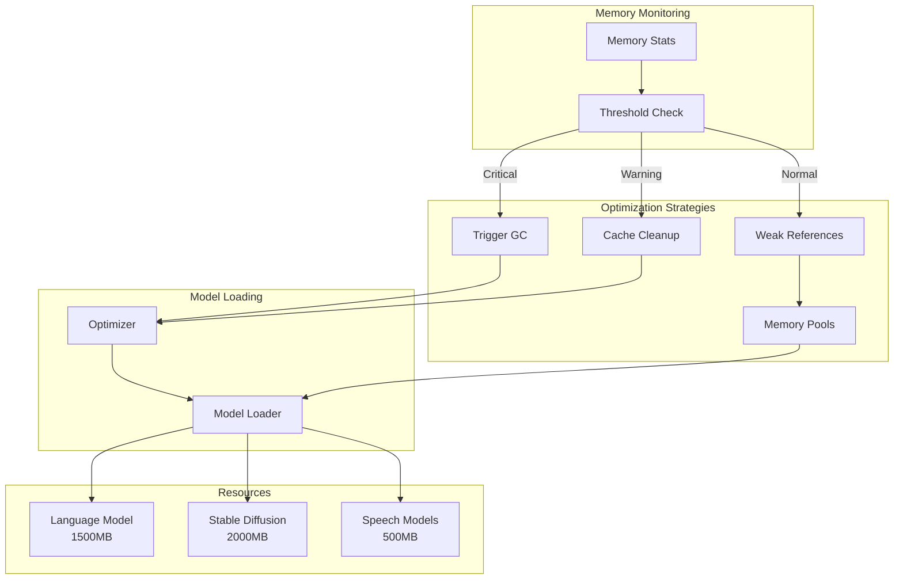
```mermaid
flowchart TB
    subgraph "Memory Monitoring"
        MS[Memory Stats]
        TH[Threshold Check]
    end

    subgraph "Optimization Strategies"
        WR[Weak References]
        MP[Memory Pools]
        CC[Cache Cleanup]
        GC[Trigger GC]
    end

    subgraph "Model Loading"
        ML[Model Loader]
        OPT[Optimizer]
    end

    subgraph "Resources"
        LM[Language Model<br/>1500MB]
        SD[Stable Diffusion<br/>2000MB]
        SP[Speech Models<br/>500MB]
    end

    MS --> TH
    TH -->|Critical| GC
    TH -->|Warning| CC
    TH -->|Normal| WR

    GC --> OPT
    CC --> OPT
    WR --> MP

    OPT --> ML
    MP --> ML

    ML --> LM
    ML --> SD
    ML --> SP
```

---

## 11. Class Hierarchy

### 11.1 Cognitive System Classes

```mermaid
classDiagram
    class CognitiveEngine {
        -hypergraph: Hypergraph
        -schemeGrammar: SchemeCognitiveGrammar
        -tensorProcessor: TensorFragmentProcessor
        -ecanKernel: ECANKernel
        -metaCognitiveSystem: MetaCognitivePathwaySystem
        +processSchemeExpression(String): ProcessingResult
        +getCognitiveState(): CognitiveState
        +performAttentionAllocation(): AttentionAllocationResult
        +performPhase5Cycle(): Phase5CycleResult
    }

    class Hypergraph {
        -atoms: Set~Atom~
        -links: Map~Atom,Atom~
        -tensors: Map~Atom,CognitiveTensor~
        +addAtom(Atom): Boolean
        +removeAtom(Identifier): Boolean
        +getActiveTensors(Float): List~CognitiveTensor~
        +performActivationSpreading(): ActivationSpreadingResult
    }

    class Atom {
        +id: Identifier
        +type: AtomType
        +name: String
        +truthValue: TruthValue
        +attentionValue: AttentionValue
    }

    class CognitiveTensor {
        +modality: Float
        +depth: Float
        +context: Float
        +salience: Float
        +autonomyIndex: Float
        +valence: Float
        +arousal: Float
        +confidence: Float
        +complexity: Float
        +computeAttentionWeight(): Float
        +isValid(): Boolean
    }

    CognitiveEngine --> Hypergraph
    CognitiveEngine --> CognitiveTensor
    Hypergraph --> Atom
    Hypergraph --> CognitiveTensor
```

### 11.2 Personality System Classes

```mermaid
classDiagram
    class TogaPersonality {
        -personality: TogaPersonalityTensor
        -emotionalState: TogaEmotionalState
        -obsessionTargets: List~String~
        -memory: Deque~Interaction~
        +frameInput(String): String
        +addCommentary(String, String): String
        +updateEmotionalState(String, Float, Float, String?)
        +processInteraction(String): String
    }

    class TogaPersonalityTensor {
        +cheerfulness: Float
        +obsessiveness: Float
        +playfulness: Float
        +chaos: Float
        +vulnerability: Float
        +noActualHarm: Float
        +respectBoundaries: Float
        +constructiveExpression: Float
        +evolveTrait(String, Float): Boolean
        +inherit(Float): TogaPersonalityTensor
    }

    class TogaEmotionalState {
        +state: EmotionalState
        +intensity: Float
        +duration: Float
        +trigger: String?
        +decay(Float)
    }

    class EmotionalIntelligenceEngine {
        -emotionKeywords: Map~EmotionCategory,List~String~~
        -sentimentKeywords: Map~String,List~String~~
        +analyzeEmotionalContext(String): EmotionalContext
        +generateEmpatheticResponse(EmotionalContext): EmpatheticResponse
        +detectEmotionalTriggers(String): List~Tuple~
    }

    TogaPersonality --> TogaPersonalityTensor
    TogaPersonality --> TogaEmotionalState
    TogaPersonality --> EmotionalIntelligenceEngine
```

---

## 12. Component Dependencies

### 12.1 Module Dependency Graph

```mermaid
graph TB
    subgraph "Application"
        TA[TogaiApplication]
        MA[MainActivity]
    end

    subgraph "Core"
        CE[cognitive]
        AID[aid]
        QP[quantum]
        EV[evolution]
    end

    subgraph "Services"
        LAYLA[layla]
        TOGA[ai.wonderful]
    end

    subgraph "Infrastructure"
        OPT[optimization]
        NAT[native]
        DB[db]
        JNI[jni]
    end

    subgraph "Python"
        PY[python.helpers]
        TEST[tests]
    end

    TA --> CE
    TA --> QP
    TA --> EV
    TA --> OPT

    MA --> LAYLA
    MA --> TOGA

    CE --> AID
    CE --> DB

    QP --> NAT
    EV --> QP
    EV --> OPT

    LAYLA --> JNI
    LAYLA --> NAT

    TOGA --> PY
    PY --> TEST

    style TA fill:#e3f2fd
    style MA fill:#e3f2fd
    style CE fill:#fff3e0
    style AID fill:#fff3e0
    style QP fill:#fff3e0
    style EV fill:#fff3e0
    style LAYLA fill:#e8f5e9
    style TOGA fill:#e8f5e9
```

### 12.2 Native Library Dependencies

```mermaid
graph LR
    subgraph "Core Libraries"
        CPP[c++_shared]
        FOLLY[folly_runtime]
        FBJNI[fbjni]
        GLOG[glog]
    end

    subgraph "AI/ML Libraries"
        GGML[ggml]
        LLAMA[llama]
        ONNX[onnxruntime]
        NCNN[ncnn]
        TVM[tvm4j]
    end

    subgraph "GPU Libraries"
        OCL[opencl]
        VK[vulkan]
    end

    subgraph "Image Libraries"
        SD[sd-jni]
        MP[mediapipe]
    end

    subgraph "Speech Libraries"
        KALDI[kaldi]
        SHERPA[sherpa]
        PIPER[piper]
    end

    subgraph "Animation Libraries"
        RIVE[rive]
        CUBISM[cubism]
    end

    CPP --> GGML
    CPP --> ONNX
    FOLLY --> GGML

    GGML --> LLAMA
    LLAMA --> TVM

    OCL --> SD
    VK --> SD

    KALDI --> SHERPA
    SHERPA --> PIPER
```

---

## 13. Sequence Diagrams

### 13.1 Chat Processing Sequence

```mermaid
sequenceDiagram
    actor User
    participant UI as MainActivity
    participant Layla as LaylaAssistant
    participant Chat as ChatService
    participant Inf as InferenceService
    participant Toga as TogaPersonality
    participant EI as EmotionalIntelligence

    User->>UI: Send Message
    UI->>Layla: sendMessage(text)

    Layla->>Toga: frameInput(text)
    Toga->>EI: analyzeEmotionalContext(text)
    EI-->>Toga: EmotionalContext
    Toga->>Toga: updateEmotionalState()
    Toga-->>Layla: framedInput

    Layla->>Chat: processMessage(framedInput)
    Chat->>Inf: generateResponse(framedInput)
    Inf-->>Chat: rawResponse

    Chat->>Toga: addCommentary(rawResponse)
    Toga->>EI: generateEmpatheticResponse()
    EI-->>Toga: EmpatheticResponse
    Toga-->>Chat: personalizedResponse

    Chat-->>Layla: Result<String>
    Layla-->>UI: Display Response
    UI-->>User: Show Message
```

### 13.2 Multimodal Processing Sequence

```mermaid
sequenceDiagram
    participant C as Client
    participant O as MultimodalOrchestrator
    participant L as LanguageEngine
    participant I as ImageEngine
    participant S as SpeechEngine
    participant Q as QuantumProcessor
    participant F as FusionFramework

    C->>O: processMultimodal(request)

    par Parallel Processing
        O->>L: processLanguage(text)
        L-->>O: LanguageResult
    and
        O->>I: generateImage(prompt)
        I-->>O: ImageResult
    and
        O->>S: processSpeech(audio)
        S-->>O: SpeechResult
    and
        O->>Q: processQuantum(tensor)
        Q-->>O: QuantumResult
    end

    O->>F: fuseResults(results)
    F->>F: computeConfidences()
    F->>F: applyFusionStrategy()
    F-->>O: FusedResult

    O-->>C: MultimodalResponse
```

### 13.3 Cognitive Engine Processing

```mermaid
sequenceDiagram
    participant App as Application
    participant CE as CognitiveEngine
    participant HG as Hypergraph
    participant SG as SchemeGrammar
    participant TP as TensorProcessor
    participant EK as ECANKernel
    participant MC as MetaCognitive

    App->>CE: processSchemeExpression(expr)

    CE->>SG: parseExpression(expr)
    SG-->>CE: List<Atom>

    loop For each Atom
        CE->>HG: addAtom(atom)
        HG-->>CE: success
        CE->>TP: atomToFragment(atom)
        TP-->>CE: TensorFragment
    end

    CE->>EK: allocateAttention()
    EK->>HG: getActiveTensors()
    HG-->>EK: tensors
    EK-->>CE: AttentionAllocationResult

    CE->>MC: performIntrospection()
    MC-->>CE: IntrospectionResult

    CE-->>App: ProcessingResult
```

---

## 14. Deployment Architecture

### 14.1 Android Application Structure

```mermaid
graph TB
    subgraph "Android Package (APK)"
        subgraph "Kotlin Code"
            KC[org.ninelym.*<br/>120+ Kotlin files]
        end

        subgraph "Native Libraries (jniLibs/arm64-v8a)"
            NL[87 .so libraries<br/>AI/ML, GPU, Speech]
        end

        subgraph "Resources"
            RES[res/<br/>Layouts, Drawables, Values]
        end

        subgraph "Assets"
            ASS[assets/<br/>Models, Configs]
        end
    end

    subgraph "External Services"
        FB[Firebase<br/>Auth, Firestore, Analytics]
        GP[Google Play<br/>Billing, Distribution]
    end

    KC --> NL
    KC --> FB
    KC --> GP
```

### 14.2 Docker Deployment

```mermaid
graph TB
    subgraph "Docker Container"
        subgraph "Python Environment"
            PY[Python 3.11]
            PH[python/helpers/]
            PE[python/examples/]
        end

        subgraph "Volume Mounts"
            VOL[/app/data<br/>Persistent Storage]
        end

        subgraph "Health Check"
            HC[Personality Init Check]
        end
    end

    subgraph "Host"
        HOST[Port 8000]
    end

    PY --> PH
    PH --> PE
    PE --> HC
    HOST --> PY

    style PY fill:#fff59d
    style VOL fill:#b2dfdb
```

---

## Appendix: Diagram Legend

### Color Coding

| Color | Meaning |
|-------|---------|
| Blue (#bbdefb, #e3f2fd) | Phase 1 / Foundation / UI Layer |
| Green (#c8e6c9, #e8f5e9) | Phase 2 / Enhancement / Service Layer |
| Yellow (#fff9c4, #fff3e0) | Phase 3 / Integration / AI Core |
| Orange (#ffccbc) | Phase 4 / Polish / Infrastructure |
| Red (#ffcdd2) | Immutable / Critical / Constraints |
| Teal (#b2dfdb) | Storage / Data |

### Shape Meanings

- **Rectangle**: Component or Module
- **Diamond**: Decision Point
- **Parallelogram**: Input/Output
- **Stadium**: State
- **Circle**: Event

---

*End of Architecture Diagrams*
