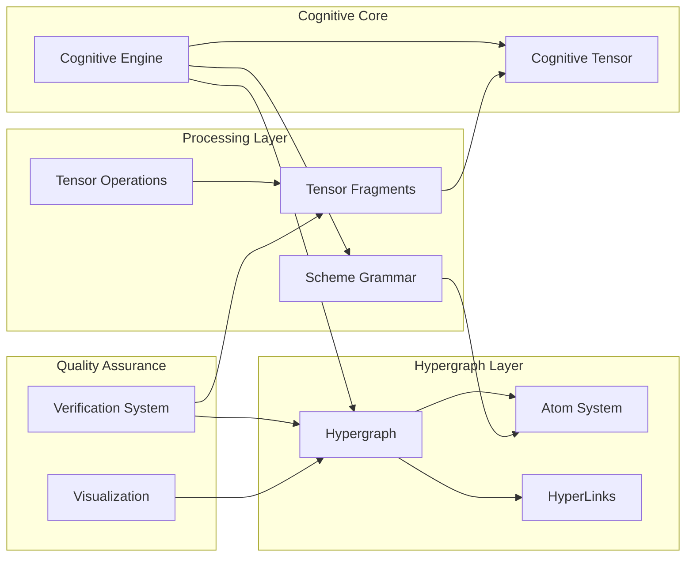

# Cognitive Computing Module Documentation

## Overview

The Cognitive Computing Module implements Phase 1 of the cognitive system: **Cognitive Primitives & Foundational Hypergraph Encoding**. This module establishes atomic vocabulary and bidirectional translation between agentic kernel ML primitives and AtomSpace hypergraph patterns.

## Architecture

### Core Components



## Tensor Signature

The core tensor signature for cognitive primitives is:

**`[modality, depth, context, salience, autonomy_index]`**

- **modality**: Input/output modality (vision, audio, text, etc.) [0.0-1.0]
- **depth**: Processing depth in the cognitive hierarchy [≥0.0]
- **context**: Contextual relevance and semantic binding [0.0-1.0]
- **salience**: Attention-weighted importance [0.0-1.0]
- **autonomy_index**: Level of autonomous processing capability [0.0-1.0]

## Key Classes

### CognitiveTensor
Core tensor representation with validation and attention computation.

```kotlin
val tensor = CognitiveTensor(
    modality = 0.5f,
    depth = 1.0f,
    context = 0.8f,
    salience = 0.7f,
    autonomyIndex = 0.6f
)
```

### Atom
Atomic element in the cognitive hypergraph, compatible with OpenCog's AtomSpace.

```kotlin
val atom = Atom(
    id = "concept-1",
    type = AtomType.CONCEPT,
    name = "dog",
    truthValue = TruthValue.TRUE,
    attentionValue = AttentionValue.HIGH_ATTENTION
)
```

### Hypergraph
Container for atoms and hyperlinks with relationship management.

```kotlin
val hypergraph = Hypergraph()
hypergraph.addAtom(atom)
val connectedAtoms = hypergraph.getConnectedAtoms("concept-1")
```

### CognitiveEngine
Main integration point for all cognitive computing operations.

```kotlin
val engine = CognitiveEngine()
engine.processSchemeExpression("(concept dog)")
val state = engine.getCognitiveState()
```

## Scheme Cognitive Grammar

### Supported Operations

- `(concept name)` - Creates a concept atom
- `(inherit child parent)` - Creates inheritance relationship
- `(similar obj1 obj2)` - Creates similarity relationship  
- `(implies premise conclusion)` - Creates implication relationship

### Example Usage

```kotlin
val engine = CognitiveEngine()

// Add concepts
engine.processSchemeExpression("(concept dog)")
engine.processSchemeExpression("(concept animal)")

// Create relationships
engine.processSchemeExpression("(inherit dog animal)")

// Generate Scheme from atoms
val schemeExpr = engine.generateSchemeExpression(AtomType.INHERITANCE)
```

## Verification and Visualization

### Verification System

Validates tensor integrity, hypergraph consistency, and system health.

```kotlin
val verificationReport = engine.verify()
println("System Health: ${verificationReport.overallHealth}")
println("Valid Components: ${verificationReport.validComponents}/${verificationReport.totalComponents}")
```

### Visualization Options

- **Summary Report**: Overview of cognitive system state
- **Hypergraph Visualization**: Text-based graph representation
- **DOT Graph**: Graphviz-compatible format
- **CSV Export**: Data export for analysis

```kotlin
// Generate summary report
val summary = engine.visualize(VisualizationFormat.SUMMARY)

// Export for Graphviz
val dotGraph = engine.visualize(VisualizationFormat.DOT_GRAPH)

// Export tensor data
val csvData = engine.visualize(VisualizationFormat.CSV_EXPORT)
```

## Integration with Android Architecture

The cognitive module integrates with the existing Android architecture through:

- **Service Layer**: CognitiveEngine can be wrapped as an Android Service
- **Business Logic**: Integration with existing use cases and repositories
- **Data Layer**: Hypergraph can persist to local database
- **UI Layer**: Visualization components can be displayed in fragments

## Performance Considerations

- **Memory Management**: Automatic cleanup of old tensor fragments
- **Attention Filtering**: Only active atoms (high attention) are processed
- **Batch Operations**: Multiple atoms can be processed together
- **Lazy Evaluation**: Expensive operations are deferred until needed

## Usage Examples

### Basic Cognitive Processing

```kotlin
val engine = CognitiveEngine()

// Process cognitive primitives
engine.addCognitivePrimitive(
    name = "visual-input",
    type = AtomType.CONCEPT,
    tensor = CognitiveTensor(0.8f, 1.0f, 0.9f, 0.7f, 0.5f)
)

// Process Scheme expressions
engine.processSchemeExpression("(similar dog wolf)")

// Get system state
val stats = engine.getStatistics()
println("Active atoms: ${stats.totalAtoms}")
println("System health: ${stats.systemHealthPercentage}%")
```

### Attention-Based Processing

```kotlin
// Get highly salient atoms
val activeTensors = hypergraph.getActiveTensors(minAttention = 0.7f)

// Process only important fragments
val importantFragments = tensorProcessor.getActiveFragments(0.5f)

// Optimize memory usage
engine.optimize()
```

This cognitive computing module provides the foundation for advanced AI capabilities while maintaining compatibility with the existing Android application architecture.