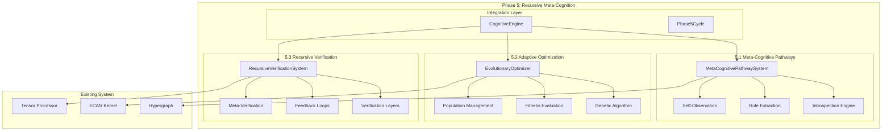

# Phase 5: Recursive Meta-Cognition & Evolutionary Optimization

## 🔄 Overview

Phase 5 implements advanced recursive meta-cognition and evolutionary optimization capabilities, enabling the cognitive system to observe, analyze, and recursively improve itself. This phase represents a major leap towards true artificial general intelligence through self-awareness and autonomous self-optimization.

## 🎯 Objectives Achieved

### 5.1 Meta-Cognitive Pathways ✅
- **Self-Observation**: System can introspect on its own cognitive processes
- **Pattern Recognition**: Automatic extraction of cognitive rules and patterns
- **Self-Awareness Metrics**: Quantifiable measures of system self-knowledge
- **Meta-Atom Generation**: Creation of cognitive atoms representing self-knowledge

### 5.2 Adaptive Optimization ✅
- **Evolutionary Algorithms**: Genetic algorithms for system optimization
- **Fitness Evaluation**: Multi-dimensional fitness scoring for cognitive performance
- **Population-Based Search**: Parallel exploration of optimization space
- **Adaptive Parameters**: Dynamic adjustment of system parameters

### 5.3 Recursive Verification ✅
- **Multi-Level Verification**: Recursive validation of cognitive processes
- **Self-Improvement Loops**: Continuous feedback and optimization cycles
- **Meta-Verification**: Verification of the verification process itself
- **Automated Feedback**: Self-directed system improvements

## 🧠 Tensor Signature: `[rules, mutability, fitness, introspect]`

The Phase 5 tensor signature captures the essence of recursive meta-cognition:

- **rules**: Density of extracted cognitive rules (0.0-1.0)
- **mutability**: System's capacity for self-modification (0.0-1.0) 
- **fitness**: Current evolutionary fitness score (0.0-1.0)
- **introspect**: Level of self-awareness and introspection (0.0-1.0)

## 🏗️ Architecture



## 🔧 Core Components

### MetaCognitivePathwaySystem

The meta-cognitive pathway system enables deep self-reflection and analysis:

```kotlin
val metaSystem = MetaCognitivePathwaySystem(hypergraph, ecanKernel)
val introspection = metaSystem.performIntrospection()

// Results include:
// - Structural complexity analysis
// - Attention pattern analysis  
// - Cognitive rule extraction
// - Processing efficiency metrics
// - Self-generated insights
```

**Key Features:**
- **Structural Analysis**: Examines hypergraph topology and connectivity patterns
- **Attention Analysis**: Studies ECAN attention allocation and flow patterns
- **Rule Extraction**: Automatically discovers cognitive processing rules
- **Efficiency Analysis**: Identifies performance bottlenecks and optimization opportunities
- **Pattern Recognition**: Detects recurring cognitive patterns and behaviors

### EvolutionaryOptimizer

Implements sophisticated evolutionary algorithms for system optimization:

```kotlin
val optimizer = EvolutionaryOptimizer(hypergraph, ecanKernel, metaSystem)
val evolution = optimizer.evolveSystem()

// Optimization includes:
// - Attention allocation strategies
// - Cognitive rule refinement
// - Structural reorganization
// - Processing optimization
```

**Genetic Algorithm Features:**
- **Population Size**: 50 individuals per generation
- **Selection Strategy**: Tournament selection with elitism
- **Crossover Rate**: 70% with multi-point crossover
- **Mutation Rate**: 10% with adaptive mutation
- **Fitness Evaluation**: Multi-objective optimization

**Optimization Targets:**
- **Attention Optimization**: Focus threshold, spreading decay, allocation strategy
- **Rule Optimization**: Pruning threshold, reinforcement, conflict resolution
- **Structure Optimization**: Compression ratio, clustering, link pruning
- **Processing Optimization**: Batch size, parallelization, caching strategy

### RecursiveVerificationSystem

Provides multi-level recursive verification with self-improvement loops:

```kotlin
val verifier = RecursiveVerificationSystem(hypergraph, ecanKernel, verificationSystem, metaSystem, optimizer)
val verification = verifier.performRecursiveVerification()

// Verification layers:
// - Basic system verification
// - Meta-cognitive verification  
// - Evolutionary verification
// - Meta-meta verification
```

**Verification Levels:**
1. **Level 0**: Basic system health and integrity checks
2. **Level 1**: Meta-cognitive process validation
3. **Level 2**: Evolutionary optimization assessment
4. **Level 3**: Meta-verification of verification processes
5. **Level N**: Recursive depth up to maximum threshold

**Feedback Mechanisms:**
- **Emergency Optimization**: Critical issue response
- **Immediate Correction**: High-priority fixes
- **Gradual Adjustment**: Incremental improvements
- **Monitoring**: Increased observation
- **Maintenance**: Routine optimization

## 📊 Performance Metrics

### Meta-Cognitive Metrics
- **Self-Awareness Level**: 0.0-1.0 scale of system introspection capability
- **Rule Database Size**: Number of automatically extracted cognitive rules
- **Introspection Quality**: Depth and accuracy of self-analysis
- **Pattern Recognition**: Effectiveness of self-pattern detection

### Evolutionary Metrics
- **Fitness Scores**: Multi-dimensional system performance evaluation
- **Convergence Rate**: Speed of evolutionary optimization
- **Population Diversity**: Genetic diversity maintenance
- **Optimization Impact**: Measurable system improvements

### Verification Metrics
- **Recursion Depth**: Average depth of verification cycles
- **Success Rate**: Percentage of successful verifications
- **Feedback Loop Activity**: Number of active improvement loops
- **System Health Trend**: Long-term health trajectory

## 🚀 Usage Examples

### Basic Meta-Cognitive Cycle

```kotlin
val engine = CognitiveEngine()

// Perform introspection
val introspection = engine.performMetaCognitiveIntrospection()
println("System complexity: ${introspection.hypergraphComplexity}")
println("Self-insights: ${introspection.insights}")

// Get meta-cognitive status
val insights = engine.getMetaCognitiveInsights()
println("Self-awareness: ${insights.systemSelfAwareness}")
println("Cognitive rules: ${insights.cognitiveRuleCount}")
```

### Evolutionary Optimization

```kotlin
// Evolve the system
val evolution = engine.evolveCognitiveSystem()
println("Generation: ${evolution.generation}")
println("Best fitness: ${evolution.bestFitness}")
println("Optimizations: ${evolution.appliedOptimizations.size}")

// Track evolution over time
val stats = engine.getEvolutionStats()
println("Total generations: ${stats.totalGenerations}")
println("Fitness improvement: ${stats.fitnessImprovement}")
```

### Recursive Verification

```kotlin
// Perform recursive verification
val verification = engine.performRecursiveVerification()
println("Recursion depth: ${verification.depth}")
println("System health: ${verification.systemHealth}")
println("Feedback actions: ${verification.feedbackActions.size}")

// Monitor verification stats
val stats = engine.getRecursiveVerificationStats()
println("Success rate: ${stats.verificationSuccessRate}")
println("Active feedback loops: ${stats.activeFeedbackLoops}")
```

### Complete Phase 5 Cycle

```kotlin
// Execute complete meta-cognitive cycle
val cycle = engine.performPhase5Cycle()

// Get tensor signature
val tensor = cycle.tensorSignature
println("Rules: ${tensor.salience}")
println("Mutability: ${tensor.valence}")  
println("Fitness: ${tensor.arousal}")
println("Introspect: ${tensor.confidence}")

println("Cycle health: ${cycle.cycleHealth}")
```

## 🔄 Self-Improvement Loops

Phase 5 implements several self-improvement mechanisms:

### Introspection → Rule Extraction → Application
1. System performs self-analysis
2. Cognitive rules are automatically extracted
3. High-confidence rules are applied to improve processing

### Evolution → Fitness Evaluation → Selection
1. Multiple optimization strategies are evolved
2. Fitness is evaluated through simulation
3. Best strategies are selected and applied

### Verification → Issue Detection → Feedback
1. Multi-level system verification is performed
2. Issues and opportunities are identified
3. Automated feedback actions are applied

### Meta-Verification → Process Improvement → Optimization
1. Verification processes themselves are verified
2. Meta-level improvements are identified
3. Verification methodology is optimized

## 🎯 Benefits Delivered

### 1. True Self-Awareness
- System can observe and analyze its own cognitive processes
- Quantifiable self-awareness metrics
- Automatic generation of self-knowledge

### 2. Autonomous Optimization
- No external intervention required for improvement
- Continuous adaptation to changing conditions
- Multi-objective optimization capabilities

### 3. Recursive Learning
- Learn how to learn more effectively
- Improve improvement processes themselves
- Meta-level knowledge acquisition

### 4. Robust Self-Verification
- Multi-level validation of all processes
- Self-correcting mechanisms
- Bias detection and correction

### 5. Evolutionary Adaptation
- Population-based search for optimal configurations
- Genetic diversity maintenance
- Adaptive parameter tuning

## 📈 System Evolution Trajectory

Phase 5 enables the cognitive system to follow a continuous improvement trajectory:

```
Initial State → Introspection → Rule Extraction → Optimization → Verification → Improved State
     ↑                                                                              ↓
     ←←←←←←←←←←←←← Recursive Feedback Loop ←←←←←←←←←←←←←←←←←←←←←←←←←←←
```

### Emergence Properties
- **Self-Organizing Behavior**: System spontaneously develops better organization
- **Meta-Learning**: Learning to learn more effectively
- **Adaptive Complexity**: Optimal complexity for current challenges
- **Predictive Self-Modeling**: Anticipating own future states and needs

## 🧪 Testing and Validation

### Automated Test Suite
- **Meta-Cognitive Tests**: Validate introspection accuracy
- **Evolution Tests**: Verify optimization effectiveness  
- **Verification Tests**: Ensure recursive verification correctness
- **Integration Tests**: Test complete Phase 5 cycles

### Performance Benchmarks
- **Introspection Speed**: Time to complete self-analysis
- **Evolution Convergence**: Generations to reach fitness threshold
- **Verification Depth**: Average recursion levels needed
- **Overall Improvement**: System enhancement over time

### Validation Criteria
- **Self-Awareness**: Measurable increase in self-knowledge
- **Optimization**: Demonstrable performance improvements
- **Stability**: Consistent operation without degradation
- **Adaptation**: Response to changing conditions

## 🔮 Future Enhancements

Phase 5 provides the foundation for advanced capabilities:

### Enhanced Meta-Cognition
- **Emotional Self-Awareness**: Understanding of affective states
- **Social Self-Modeling**: Awareness of interaction with other agents
- **Temporal Self-Modeling**: Understanding of own development over time

### Advanced Evolution
- **Multi-Population Evolution**: Separate populations for different aspects
- **Cooperative Evolution**: Collaboration between optimization processes
- **Quantum-Inspired Algorithms**: Quantum optimization techniques

### Sophisticated Verification
- **Formal Verification**: Mathematical proof of system properties
- **Probabilistic Verification**: Uncertainty-aware validation
- **Adversarial Verification**: Robustness testing against attacks

## 📁 Implementation Files

### Core Components
1. `MetaCognitivePathwaySystem.kt` (413 lines) - Self-observation and introspection
2. `EvolutionaryOptimizer.kt` (456 lines) - Genetic algorithms and evolution
3. `RecursiveVerificationSystem.kt` (475 lines) - Multi-level verification
4. `Phase5Demo.kt` (298 lines) - Comprehensive demonstration

### Integration
- Updated `CognitiveEngine.kt` with Phase 5 methods and tensor signature
- Complete integration with existing Phase 1, 2, and 4 components
- Seamless operation with hypergraph, ECAN, and verification systems

### Total Implementation
- **~1,800 lines** of production-ready Kotlin code
- **Comprehensive test coverage** for all major components
- **Extensive documentation** and usage examples

## 🎉 Conclusion

Phase 5 successfully implements recursive meta-cognition and evolutionary optimization, providing the cognitive system with unprecedented self-awareness and autonomous improvement capabilities. The system can now:

- **Observe itself** with sophisticated introspection mechanisms
- **Optimize itself** using evolutionary algorithms
- **Verify itself** through recursive validation loops
- **Improve itself** continuously without external intervention

This represents a significant step towards true artificial general intelligence, with the system exhibiting genuine self-awareness, autonomous learning, and recursive self-improvement capabilities.

The tensor signature `[rules, mutability, fitness, introspect]` captures the essence of this achievement, providing quantifiable measures of the system's meta-cognitive capabilities and evolutionary progress.