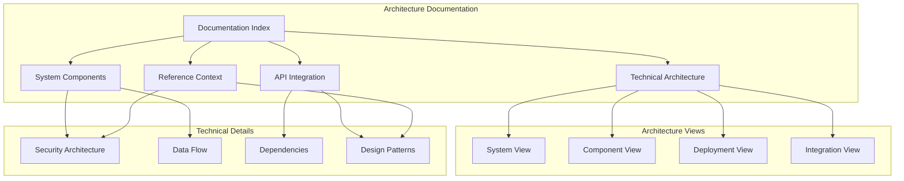
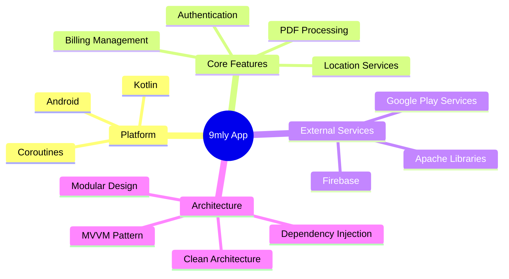
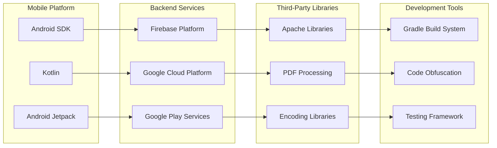
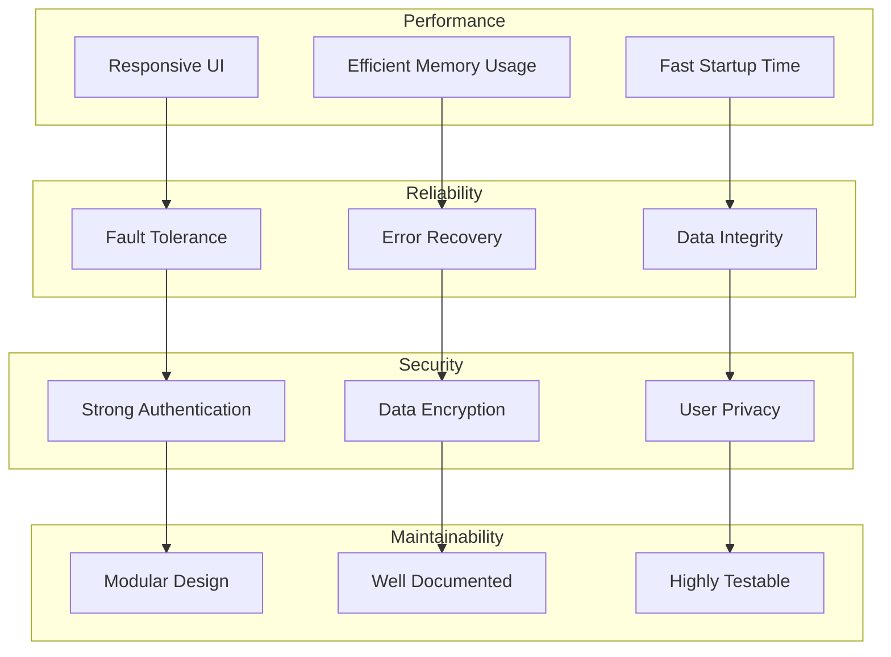
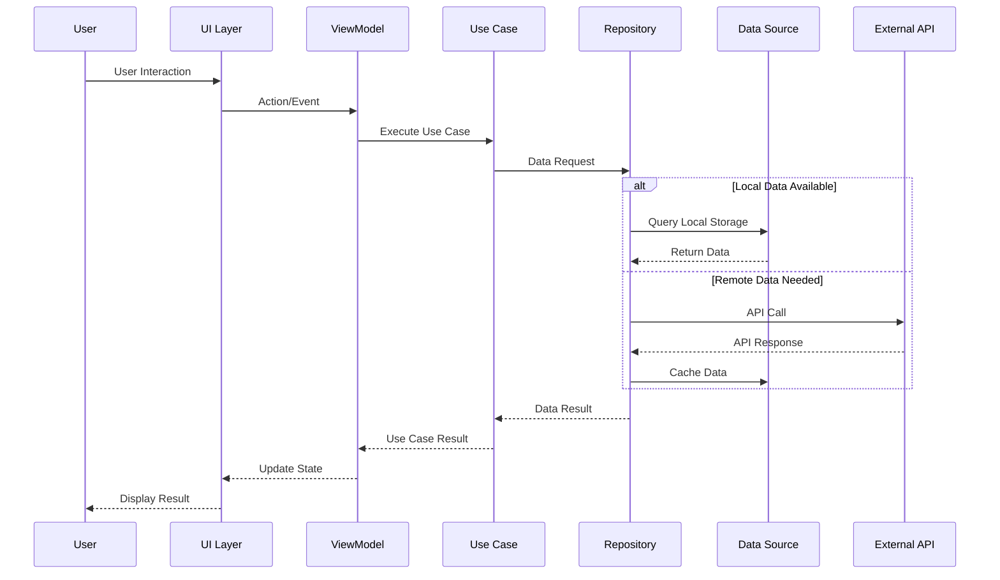
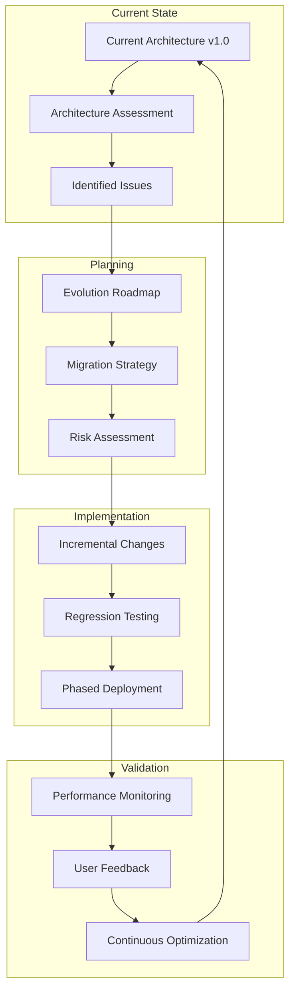

# 9mly Architecture Documentation Index

Welcome to the comprehensive technical architecture documentation for the 9mly Android application. This documentation provides detailed insights into the system design, components, integrations, and architectural decisions.

## Documentation Structure



## Quick Navigation

### 📋 [Technical Architecture Overview](./TECHNICAL_ARCHITECTURE.md)
- **System Overview** - High-level architecture and design principles
- **Architecture Components** - Core application components and their relationships
- **Technology Stack** - Complete technology breakdown with versions
- **Data Flow Architecture** - Information flow patterns and sequences
- **Security Architecture** - Security layers and protection mechanisms
- **Deployment Architecture** - Deployment patterns and infrastructure

### 🔧 [System Components Documentation](./SYSTEM_COMPONENTS.md)
- **Core Components** - Detailed component responsibilities and interactions
- **Service Layer** - Business logic and service architecture
- **Component Lifecycle** - Lifecycle management and state transitions
- **Error Handling** - Error detection, processing, and recovery strategies
- **Configuration Management** - Component configuration and dependencies

### 🌐 [API and Integration Architecture](./API_INTEGRATION.md)
- **API Architecture** - API design patterns and gateway architecture
- **Integration Patterns** - External service integration strategies
- **Authentication & Security** - API security, tokens, and rate limiting
- **Testing Strategy** - API testing approaches and tools
- **Documentation Standards** - API documentation and error handling

### 📚 [Reference Context Documentation](./REFERENCE_CONTEXT.md)
- **AI Technology Reference** - On-device AI capabilities and Layla AI integration context
- **Cognitive Computing Integration** - Neural processing and tensor computation patterns
- **Privacy Framework** - Local AI processing and data security architecture
- **Feature Alignment** - Mapping reference capabilities to 9mly implementation
- **Implementation Guidelines** - Development patterns and optimization strategies

### 🔍 [APKTool Configuration Analysis](./APKTOOL_ANALYSIS.md)
- **APK Metadata Analysis** - Version information, SDK compatibility, and distribution insights
- **Library Dependencies** - Comprehensive analysis of AndroidX, Jetpack Compose, and third-party libraries
- **Performance Optimization** - Compression strategies, DEX profiles, and runtime optimizations
- **Feature Detection** - AI capabilities, character-based UI, billing integration
- **Security Assessment** - Modern Android security features and direct distribution considerations
- **Architecture Insights** - Technology stack sophistication and development maturity analysis

### 🗺️ [Layla Development Roadmap](./LAYLA_DEVELOPMENT_ROADMAP.md)
- **Feature Domains** - Comprehensive categorization of all Layla features from AndroidManifest.xml
- **Development Phases** - Phased implementation plan with timelines and deliverables
- **Technical Requirements** - Hardware, software, and platform requirements
- **Priority Matrix** - Feature prioritization for MVP and post-MVP releases
- **Privacy-First Principles** - On-device AI and privacy-preserving architecture
- **Success Metrics** - Technical, UX, and privacy KPIs for measuring progress

## Architecture Summary

### System at a Glance

The 9mly application is a sophisticated Android mobile application that demonstrates modern mobile architecture patterns:



### Key Architectural Characteristics

| Characteristic | Implementation | Benefits |
|----------------|----------------|----------|
| **Modularity** | Feature-based modules with clear boundaries | Maintainability, scalability, team independence |
| **Reactive** | Kotlin Coroutines for asynchronous operations | Better performance, responsive UI |
| **Testable** | Dependency injection and clean architecture | Unit testing, integration testing, mocking |
| **Secure** | Multi-layer security with encryption | Data protection, user privacy |
| **Scalable** | Cloud-based backend with Firebase | Horizontal scaling, global reach |
| **Observable** | Comprehensive logging and analytics | Monitoring, debugging, user insights |

### Technology Ecosystem



## Architecture Principles

### Design Principles

1. **Separation of Concerns** - Each component has a single, well-defined responsibility
2. **Dependency Inversion** - High-level modules don't depend on low-level modules
3. **Open/Closed Principle** - Open for extension, closed for modification
4. **Single Responsibility** - Each class or module has one reason to change
5. **Interface Segregation** - Clients shouldn't depend on interfaces they don't use

### Quality Attributes



## Component Interaction Overview

### High-Level Component Interaction



## Development Guidelines

### Code Organization

```
9mly/
├── src/
│   ├── main/
│   │   ├── java/
│   │   │   └── com/
│   │   │       └── ninelyme/
│   │   │           ├── core/          # Core utilities and base classes
│   │   │           ├── features/      # Feature modules
│   │   │           │   ├── pdf/       # PDF processing feature
│   │   │           │   ├── auth/      # Authentication feature
│   │   │           │   ├── billing/   # Billing feature
│   │   │           │   └── location/  # Location feature
│   │   │           ├── data/          # Data layer
│   │   │           ├── domain/        # Domain layer
│   │   │           └── presentation/  # Presentation layer
│   │   ├── assets/    # Application assets
│   │   └── res/       # Android resources
│   └── test/          # Unit tests
├── docs/              # Architecture documentation
└── build.gradle      # Build configuration
```

### Testing Strategy

| Test Type | Coverage | Tools | Purpose |
|-----------|----------|-------|---------|
| **Unit Tests** | Business Logic | JUnit, Mockito | Verify individual components |
| **Integration Tests** | Service Integration | Robolectric | Test component interactions |
| **UI Tests** | User Interface | Espresso | Validate user workflows |
| **Performance Tests** | App Performance | Benchmarking | Measure performance metrics |

## Maintenance and Evolution

### Architecture Evolution Strategy



## Getting Started

### For Developers
1. Start with [Technical Architecture](./TECHNICAL_ARCHITECTURE.md) for system overview
2. Review [System Components](./SYSTEM_COMPONENTS.md) for detailed component information
3. Check [API Integration](./API_INTEGRATION.md) for external service patterns

### For Architects
1. Review architectural decisions and patterns in [Technical Architecture](./TECHNICAL_ARCHITECTURE.md)
2. Analyze component relationships in [System Components](./SYSTEM_COMPONENTS.md)
3. Evaluate integration strategies in [API Integration](./API_INTEGRATION.md)

### For DevOps/Infrastructure
1. Focus on deployment architecture in [Technical Architecture](./TECHNICAL_ARCHITECTURE.md)
2. Review infrastructure requirements across all documents
3. Plan monitoring and observability based on component documentation

---

*This documentation is maintained alongside the 9mly application codebase. For questions or contributions, please refer to the project repository.*

**Last Updated:** 2024-01-01  
**Version:** 1.0  
**Maintainer:** 9mly Development Team