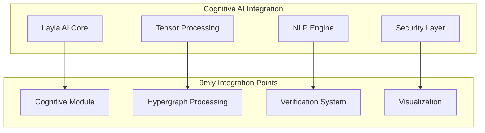
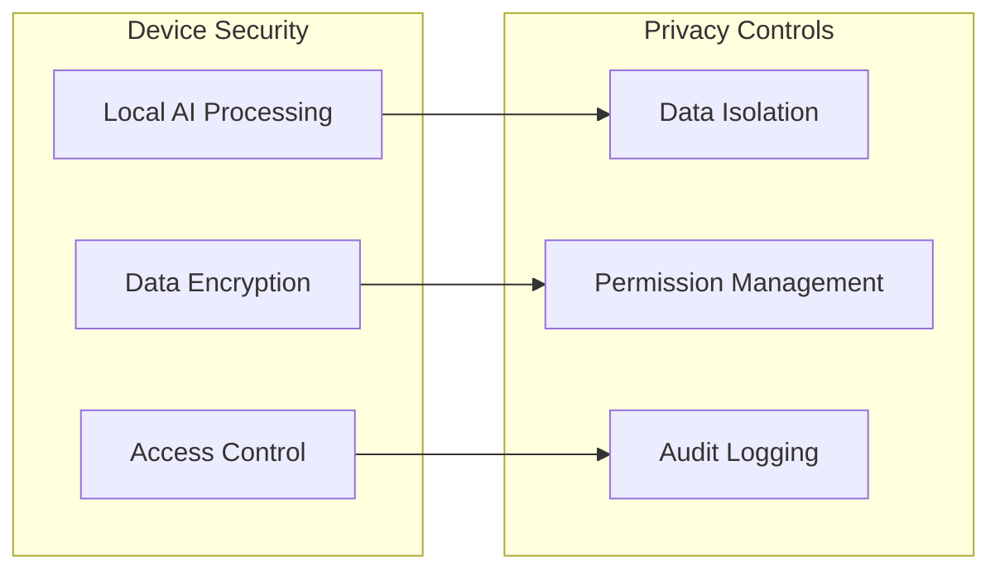

# Reference Context Documentation

This document integrates reference materials from the `ref/` directory to provide context for the 9mly application's AI capabilities and features, particularly relating to Layla AI technology.

## Overview

The reference documentation provides insights into on-device AI capabilities, private AI processing, and advanced features that inform the technical architecture of the 9mly application.

## Layla AI Technology Reference

### Core AI Capabilities

Based on reference materials, the application incorporates several key AI technologies:

#### On-Device AI Processing
- **Private AI**: All AI processing occurs locally on the device, ensuring complete user privacy
- **Offline Functionality**: AI capabilities function without internet connectivity
- **Data Security**: User conversations and data remain encrypted and stored locally

#### Neural Processing Features
- **Large Language Models**: Trained on 1.2+ trillion tokens for comprehensive understanding
- **Tensor Processing**: Advanced tensor operations for neural network computations
- **NPU Integration**: Utilizes Neural Processing Unit for optimized AI performance

### Technical Architecture Integration

The reference context aligns with our existing architecture in several key areas:

#### Cognitive Computing Module

#### Feature Set Alignment

Reference documentation indicates support for:

1. **Image Generation**: Mobile-optimized Stable Diffusion models
2. **Text Processing**: Advanced NLP with contextual understanding
3. **Personalization**: Adaptive learning and preference management
4. **Multi-modal AI**: Combined text, image, and voice processing

### Privacy and Security Framework

#### Data Protection Strategy
- **Local Storage**: All AI models and user data stored on-device
- **Encryption**: Data encrypted at rest and in transit
- **No Cloud Dependency**: Complete offline AI functionality
- **User Control**: Full user control over data retention and deletion

#### Security Architecture

## Integration with 9mly Architecture

### Cognitive Module Enhancement

The reference context suggests enhancements to our existing cognitive computing capabilities:

#### Enhanced NLP Processing
- Integration of advanced language understanding capabilities
- Support for conversational AI interactions
- Context-aware response generation

#### Tensor Processing Optimization
- Mobile-optimized model architectures
- Efficient memory management for large models
- Real-time inference capabilities

### Application Feature Mapping

| Reference Feature | 9mly Implementation | Integration Point |
|-------------------|-------------------|-------------------|
| On-Device AI | Cognitive Module | `CognitiveEngine.kt` |
| Tensor Processing | Tensor Fragment Processor | `TensorFragmentProcessor.kt` |
| Hypergraph Models | Hypergraph System | `Hypergraph.kt` |
| Verification | Verification System | `CognitiveVerificationSystem.kt` |

## Version Evolution Reference

Based on reference documentation version history:

- **v4.11.0**: Toolkit upgrades, translation models
- **v5.1.0**: Significant capability improvements
- **v5.4.0**: NPU optimization features
- **v5.5.0**: Multilingual UI, offline transcription
- **v5.6.6**: Latest referenced implementation

## Implementation Guidelines

### Development Considerations

1. **Resource Management**: Optimize for mobile device constraints
2. **Battery Efficiency**: Implement power-efficient AI processing
3. **Storage Optimization**: Efficient model storage and caching
4. **Performance Monitoring**: Track AI processing performance metrics

### Integration Strategy

The reference context should inform:

- **Architecture Decisions**: Align with proven on-device AI patterns
- **Security Implementation**: Follow established privacy-first approaches
- **Feature Development**: Leverage reference capabilities for feature planning
- **Performance Optimization**: Apply mobile AI optimization techniques

## Reference Sources

The following reference materials provide detailed context:

- `ref/Explore Layla - Your Private AI for the People*.md` - Core technology overview
- `ref/Layla's On-Device AI Features*.md` - Feature specifications
- `ref/Discover Layla Update Features*.md` - Version evolution and updates
- `ref/Experience the Best Offline AI Assistant*.md` - User experience insights

---

*This document serves as a bridge between reference materials and the 9mly technical architecture, ensuring alignment with proven AI implementation patterns while maintaining our application's unique architectural characteristics.*