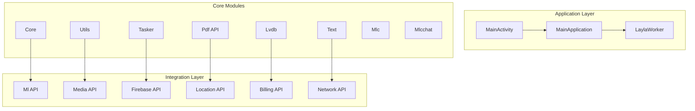
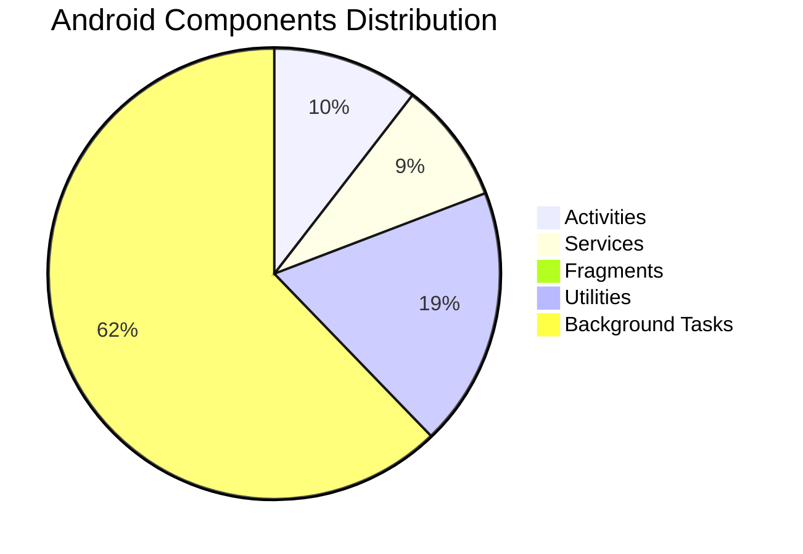
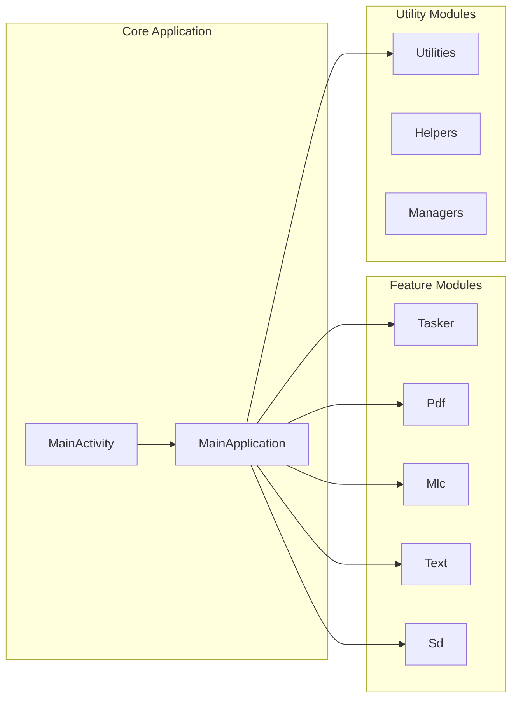
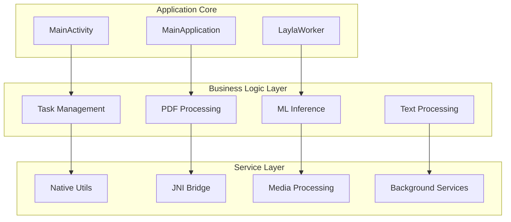
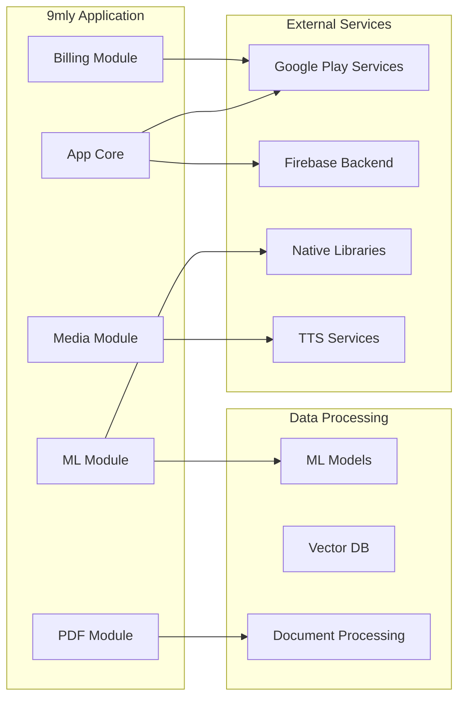
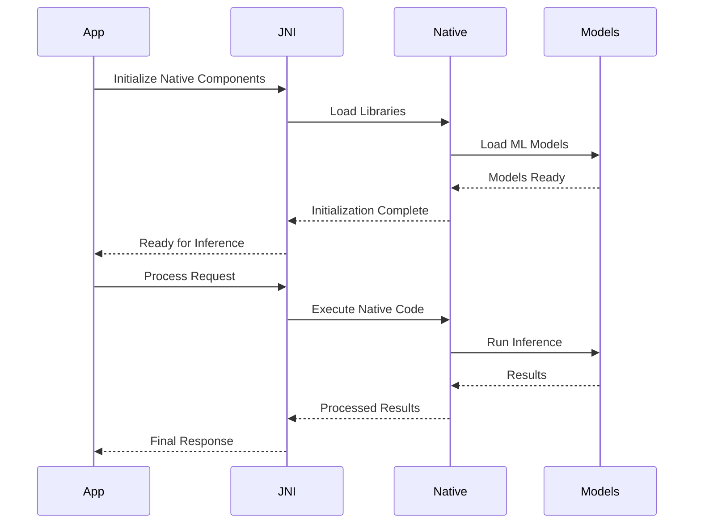
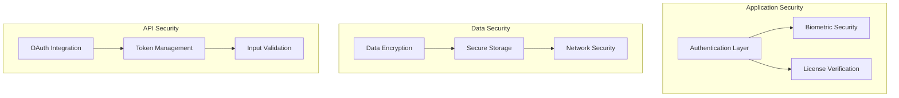
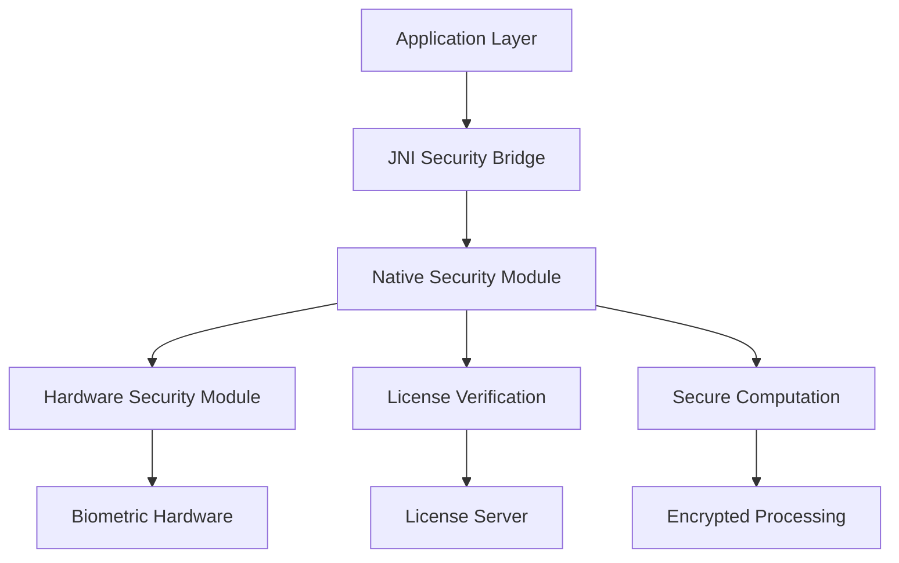

# 9mly - Smali-Based Architecture Analysis

## Architecture Overview

Based on comprehensive analysis of 188678 smali files, 9mly demonstrates a sophisticated modular architecture with the following key characteristics:

- **Total Modules Identified**: 20
- **Android Activities**: 18
- **Background Services**: 15
- **Fragment Components**: 0
- **Native Integrations**: 459

## Detailed Component Architecture

### Android Components Distribution

### Module Structure

## Dependency Architecture

### Core Dependencies Flow

### Package Dependency Matrix

The application follows a layered architecture with 2054 distinct packages:

| Layer | Packages | Dependencies |
|-------|----------|--------------|
| App Core | com.layla | MainActivity, MainApplication |
| Features | 18 modules | Tasker, PDF, MLC, Text |
| Services | 15 services | Background processing |
| Utilities | 32 classes | Helper functions |

## API Integration Architecture

### External Service Integrations

### Identified API Integrations

| Service | Components | Purpose |
|---------|------------|----------|
| Ml | 1924 components | Machine Learning, AI Inference |
| Media | 11148 components | Audio/Video Processing |
| Firebase | 133 components | Authentication, Analytics, Backend |
| Location | 291 components | GPS Services, Location Tracking |
| Billing | 3707 components | In-app Purchases, Subscriptions |
| Network | 849 components | HTTP Communications, API Calls |
| Pdf | 2551 components | Document Processing, Rendering |

### Native Integration Points

## Security Architecture

### Security Components Analysis

Based on smali analysis, the application implements multiple security layers:

### Security Features Detected

- ProviderInstaller - ProviderInstallListener
- zza
- ProviderInstaller
- Storage
- GoogleSignInOptionsExtensionParcelable
- zad
- GoogleSignInOptions - Builder
- zac
- zaa
- zaa

### Native Security Components

The application includes 459 native security components providing:

- JNI Security Bridges
- Native License Validation
- Secure Computation Modules
- Hardware-Backed Security Features

