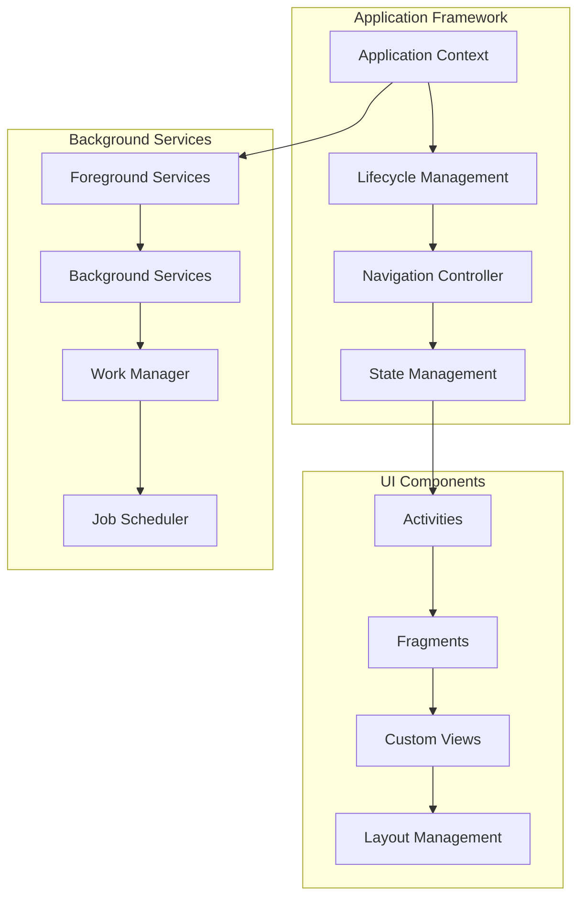
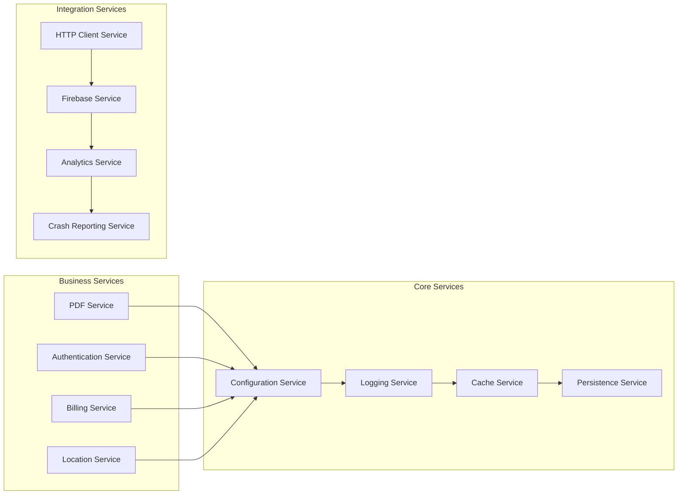
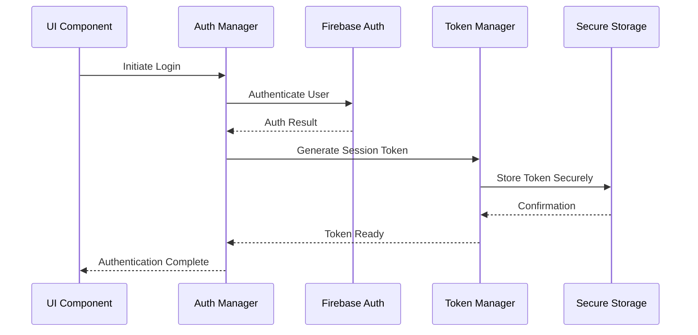
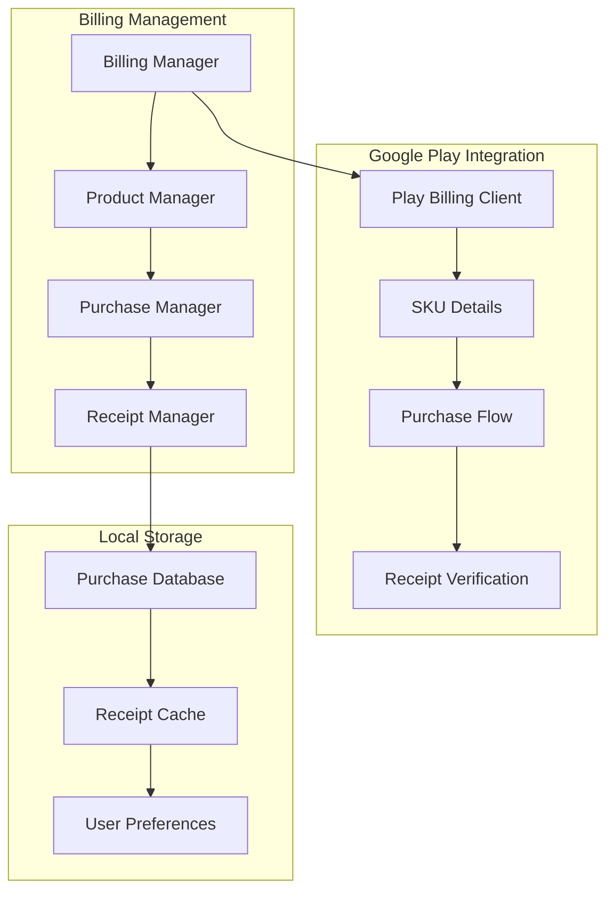
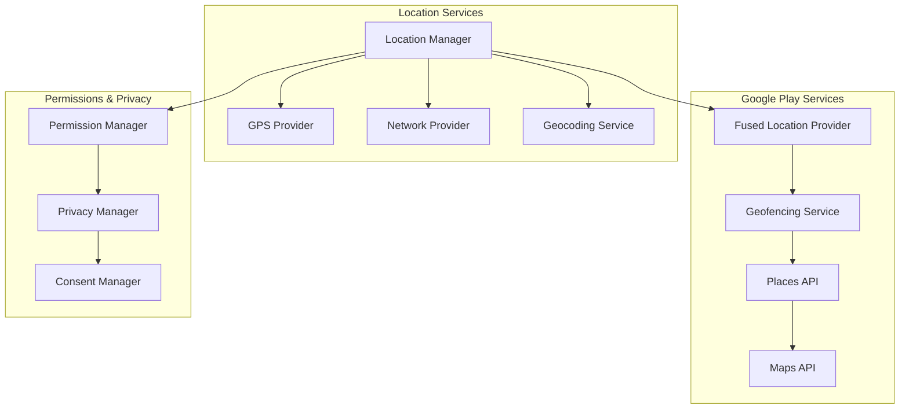
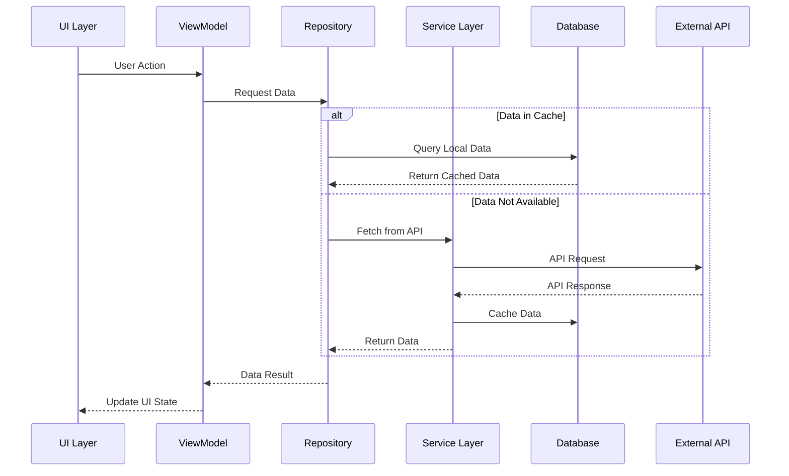
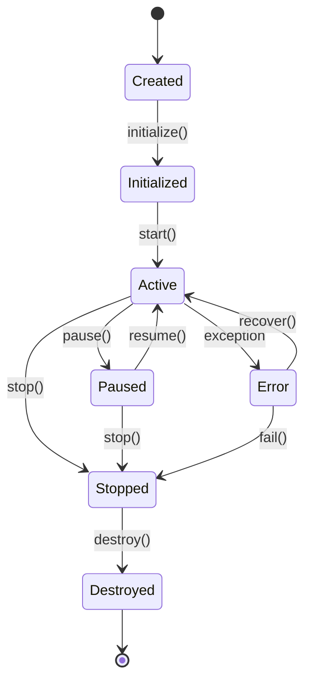
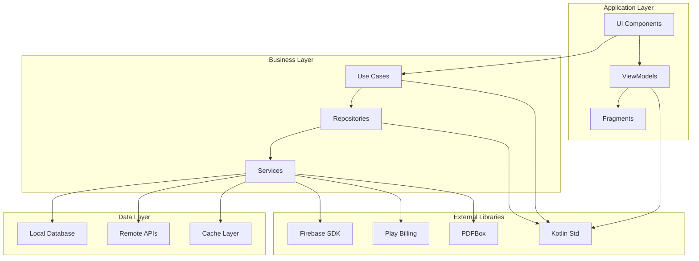
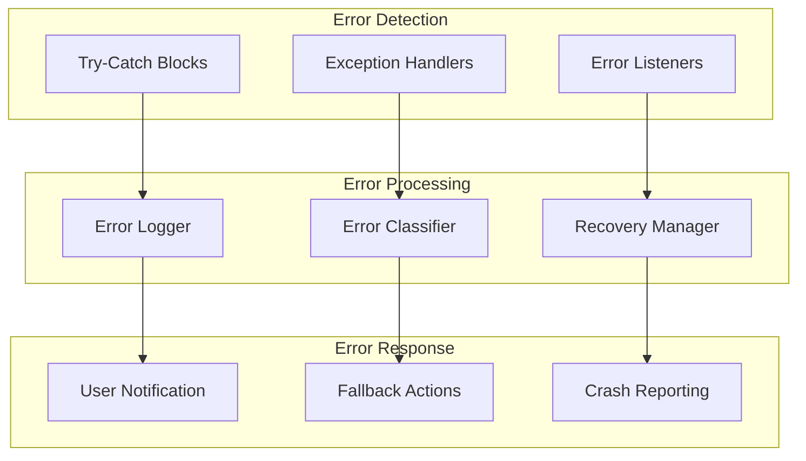

# System Components Overview

This document provides detailed documentation of the 9mly application's system components and their interactions.

## Core System Components

### Application Layer Components

### Service Layer Architecture

## Component Responsibilities

### PDF Processing Components

| Component | Responsibility | Dependencies |
|-----------|---------------|--------------|
| **PDF Reader** | Parse and load PDF documents | Apache PDFBox, FontBox |
| **PDF Renderer** | Render PDF pages for display | Graphics engine, Font manager |
| **PDF Annotator** | Handle annotations and markups | PDF Parser, User input |
| **PDF Exporter** | Export modified PDFs | File system, Permissions |
| **Font Manager** | Manage fonts and glyph mappings | Glyph lists, Font resources |

### Authentication Components

### Billing System Components

### Location Services Components

## Data Flow Between Components

### Inter-Component Communication

### Component Lifecycle Management

## Component Configuration

### Service Configuration Matrix

| Service | Configuration File | Key Settings | Dependencies |
|---------|-------------------|--------------|--------------|
| **Firebase** | firebase-encoders.properties | Version 17.0.0 | Google Play Services |
| **Billing** | billing.properties | Version 6.1.0 | Play Billing Library |
| **PDF** | N/A (Embedded) | Apache PDFBox | FontBox, Glyph Lists |
| **Location** | play-services-location.properties | Latest | Fused Location Provider |
| **Analytics** | firebase-analytics.properties | Latest | Firebase Core |

### Component Dependencies Graph

## Error Handling and Recovery

### Component Error Handling Strategy

### Recovery Mechanisms

| Component | Error Type | Recovery Strategy | Fallback |
|-----------|------------|------------------|----------|
| **PDF Service** | Parse Error | Retry with different parser | Show error message |
| **Authentication** | Network Error | Retry with exponential backoff | Offline mode |
| **Billing** | Payment Error | Retry payment flow | Store pending purchase |
| **Location** | Permission Denied | Request permission | Use last known location |
| **Firebase** | Connection Error | Queue operations | Local storage |

---

*This document details the system components and their interactions within the 9mly application architecture.*