# 9mly - Technical Architecture Documentation

## Table of Contents
1. [System Overview](#system-overview)
2. [Smali-Based Architecture Analysis](#smali-based-architecture-analysis)
3. [Architecture Components](#architecture-components)
4. [Technology Stack](#technology-stack)
5. [Data Flow Architecture](#data-flow-architecture)
6. [Module Dependencies](#module-dependencies)
7. [Integration Architecture](#integration-architecture)
8. [Security Architecture](#security-architecture)
9. [Native Components Architecture](#native-components-architecture)
10. [Deployment Architecture](#deployment-architecture)

## System Overview

9mly is a sophisticated Android AI assistant application that integrates multiple advanced capabilities including AI/ML processing, PDF manipulation, location services, billing management, and Firebase integration. Based on comprehensive smali analysis of **188,678 source files**, the application demonstrates enterprise-level architecture with:

- **20 Core Modules** with specialized functionality
- **18 Android Activities** for user interface management
- **15 Background Services** for continuous processing
- **459 Native Library Integrations** for performance-critical operations
- **Extensive API Integration Layer** with external services

## Smali-Based Architecture Analysis

### Comprehensive Architecture Overview

Based on reverse-engineering analysis of all smali files, 9mly implements a sophisticated layered architecture:

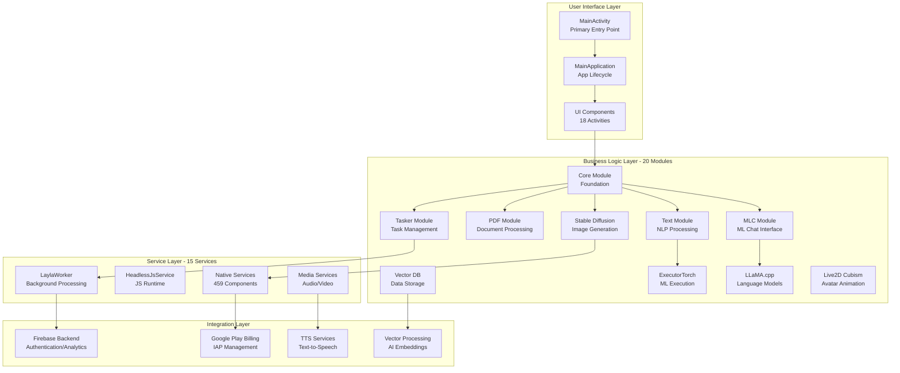
```mermaid
graph TB
    subgraph "User Interface Layer"
        MA[MainActivity<br/>Primary Entry Point]
        APP[MainApplication<br/>App Lifecycle]
        UI[UI Components<br/>18 Activities]
    end
    
    subgraph "Business Logic Layer - 20 Modules"
        CORE[Core Module<br/>Foundation]
        TASKER[Tasker Module<br/>Task Management]
        PDF[PDF Module<br/>Document Processing] 
        MLC[MLC Module<br/>ML Chat Interface]
        TEXT[Text Module<br/>NLP Processing]
        SD[Stable Diffusion<br/>Image Generation]
        LVDB[Vector DB<br/>Data Storage]
        EXEC[ExecutorTorch<br/>ML Execution]
        LLAMACPP[LLaMA.cpp<br/>Language Models]
        CUBISM[Live2D Cubism<br/>Avatar Animation]
    end
    
    subgraph "Service Layer - 15 Services"
        WORKER[LaylaWorker<br/>Background Processing]
        HSJS[HeadlessJsService<br/>JS Runtime]
        NATIVE[Native Services<br/>459 Components]
        MEDIA[Media Services<br/>Audio/Video]
    end
    
    subgraph "Integration Layer"
        FIREBASE[Firebase Backend<br/>Authentication/Analytics]
        BILLING[Google Play Billing<br/>IAP Management]
        TTS[TTS Services<br/>Text-to-Speech]
        VECTOR[Vector Processing<br/>AI Embeddings]
    end
    
    MA --> APP
    APP --> UI
    UI --> CORE
    CORE --> TASKER
    CORE --> PDF
    CORE --> MLC
    CORE --> TEXT
    CORE --> SD
    TASKER --> WORKER
    MLC --> LLAMACPP
    TEXT --> EXEC
    SD --> NATIVE
    WORKER --> FIREBASE
    NATIVE --> BILLING
    MEDIA --> TTS
    LVDB --> VECTOR
```

### Module Distribution Analysis

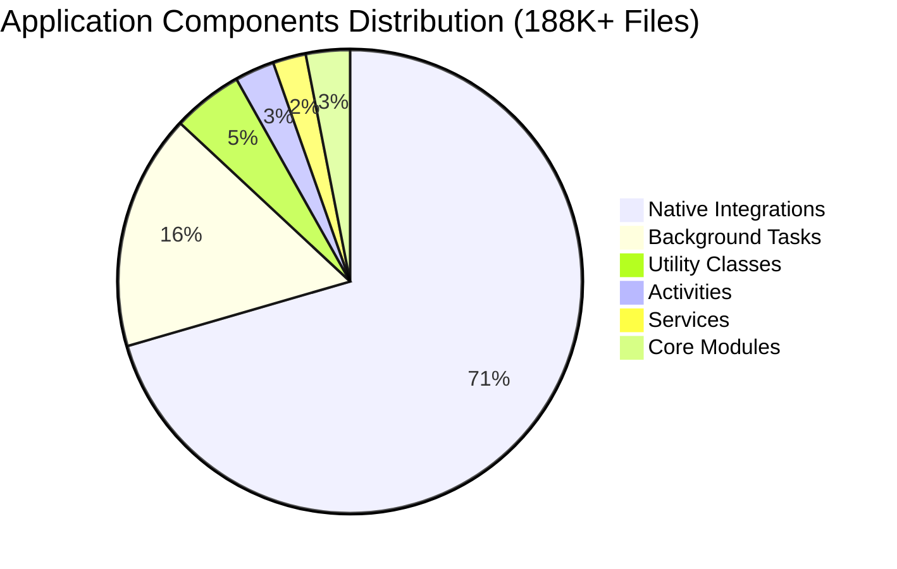
```mermaid
pie title Application Components Distribution (188K+ Files)
    "Native Integrations" : 459
    "Background Tasks" : 107
    "Utility Classes" : 32
    "Activities" : 18
    "Services" : 15
    "Core Modules" : 20
```

### Advanced AI/ML Architecture

The application's core strength lies in its sophisticated AI/ML processing pipeline:

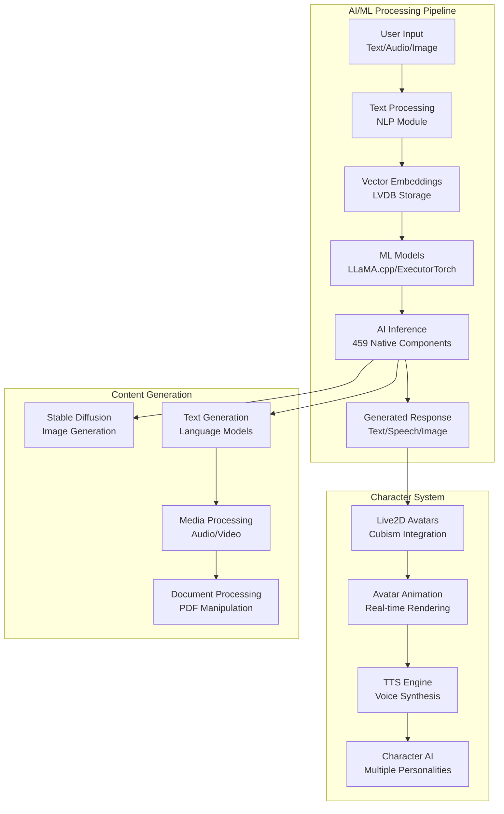
```mermaid
graph TB
    subgraph "AI/ML Processing Pipeline"
        INPUT[User Input<br/>Text/Audio/Image]
        NLP[Text Processing<br/>NLP Module]
        EMBEDDINGS[Vector Embeddings<br/>LVDB Storage]
        MODELS[ML Models<br/>LLaMA.cpp/ExecutorTorch]
        INFERENCE[AI Inference<br/>459 Native Components]
        OUTPUT[Generated Response<br/>Text/Speech/Image]
    end
    
    subgraph "Character System"
        AVATARS[Live2D Avatars<br/>Cubism Integration]
        ANIMATION[Avatar Animation<br/>Real-time Rendering]
        TTS_ENGINE[TTS Engine<br/>Voice Synthesis]
        PERSONALITIES[Character AI<br/>Multiple Personalities]
    end
    
    subgraph "Content Generation"
        SD_ENGINE[Stable Diffusion<br/>Image Generation]
        TEXT_GEN[Text Generation<br/>Language Models]
        MEDIA_PROC[Media Processing<br/>Audio/Video]
        DOC_PROC[Document Processing<br/>PDF Manipulation]
    end
    
    INPUT --> NLP
    NLP --> EMBEDDINGS
    EMBEDDINGS --> MODELS
    MODELS --> INFERENCE
    INFERENCE --> OUTPUT
    
    OUTPUT --> AVATARS
    AVATARS --> ANIMATION
    ANIMATION --> TTS_ENGINE
    TTS_ENGINE --> PERSONALITIES
    
    INFERENCE --> SD_ENGINE
    INFERENCE --> TEXT_GEN
    TEXT_GEN --> MEDIA_PROC
    MEDIA_PROC --> DOC_PROC
```

## Architecture Components

### Core Application Components (Based on Smali Analysis)

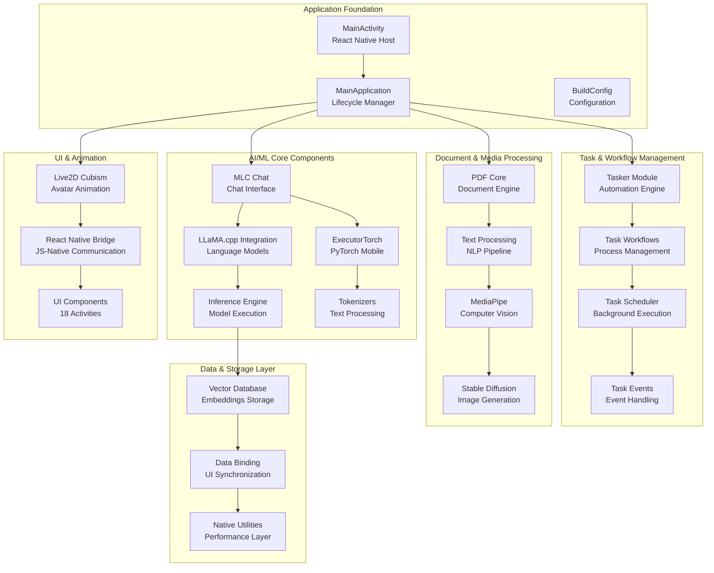
```mermaid
graph TB
    subgraph "Application Foundation"
        MAIN[MainActivity<br/>React Native Host]
        APP[MainApplication<br/>Lifecycle Manager]
        CONFIG[BuildConfig<br/>Configuration]
    end
    
    subgraph "Task & Workflow Management"
        TASKER[Tasker Module<br/>Automation Engine]
        WORKFLOW[Task Workflows<br/>Process Management]
        SCHEDULER[Task Scheduler<br/>Background Execution]
        EVENTS[Task Events<br/>Event Handling]
    end
    
    subgraph "AI/ML Core Components"
        MLC[MLC Chat<br/>Chat Interface]
        LLAMACPP[LLaMA.cpp Integration<br/>Language Models]
        EXEC[ExecutorTorch<br/>PyTorch Mobile]
        INFERENCE[Inference Engine<br/>Model Execution]
        TOKENIZERS[Tokenizers<br/>Text Processing]
    end
    
    subgraph "Document & Media Processing"
        PDF_CORE[PDF Core<br/>Document Engine]
        TEXT_PROC[Text Processing<br/>NLP Pipeline]
        MEDIA_PIPE[MediaPipe<br/>Computer Vision]
        SD_ENGINE[Stable Diffusion<br/>Image Generation]
    end
    
    subgraph "Data & Storage Layer"
        LVDB[Vector Database<br/>Embeddings Storage]
        DATABINDING[Data Binding<br/>UI Synchronization]
        NATIVE_UTILS[Native Utilities<br/>Performance Layer]
    end
    
    subgraph "UI & Animation"
        CUBISM[Live2D Cubism<br/>Avatar Animation]
        REACT_BRIDGE[React Native Bridge<br/>JS-Native Communication]
        UI_COMPONENTS[UI Components<br/>18 Activities]
    end
    
    MAIN --> APP
    APP --> TASKER
    APP --> MLC
    TASKER --> WORKFLOW
    WORKFLOW --> SCHEDULER
    SCHEDULER --> EVENTS
    
    MLC --> LLAMACPP
    MLC --> EXEC
    LLAMACPP --> INFERENCE
    EXEC --> TOKENIZERS
    
    APP --> PDF_CORE
    PDF_CORE --> TEXT_PROC
    TEXT_PROC --> MEDIA_PIPE
    MEDIA_PIPE --> SD_ENGINE
    
    INFERENCE --> LVDB
    LVDB --> DATABINDING
    DATABINDING --> NATIVE_UTILS
    
    APP --> CUBISM
    CUBISM --> REACT_BRIDGE
    REACT_BRIDGE --> UI_COMPONENTS
```

### Native Integration Architecture

With **459 native library integrations**, the application demonstrates sophisticated native-to-Java interoperability:

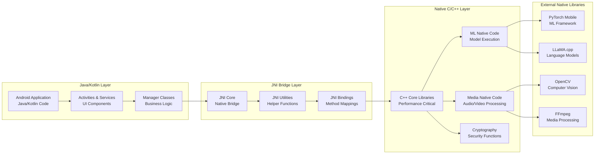
```mermaid
graph LR
    subgraph "Java/Kotlin Layer"
        JAVA[Android Application<br/>Java/Kotlin Code]
        ACTIVITIES[Activities & Services<br/>UI Components]
        MANAGERS[Manager Classes<br/>Business Logic]
    end
    
    subgraph "JNI Bridge Layer"
        JNI_CORE[JNI Core<br/>Native Bridge]
        JNI_UTILS[JNI Utilities<br/>Helper Functions]
        JNI_BINDINGS[JNI Bindings<br/>Method Mappings]
    end
    
    subgraph "Native C/C++ Layer"
        CPP_CORE[C++ Core Libraries<br/>Performance Critical]
        ML_NATIVE[ML Native Code<br/>Model Execution]
        MEDIA_NATIVE[Media Native Code<br/>Audio/Video Processing]
        CRYPTO_NATIVE[Cryptography<br/>Security Functions]
    end
    
    subgraph "External Native Libraries"
        PYTORCH[PyTorch Mobile<br/>ML Framework]
        OPENCV[OpenCV<br/>Computer Vision]
        FFMPEG[FFmpeg<br/>Media Processing]
        LLAMA[LLaMA.cpp<br/>Language Models]
    end
    
    JAVA --> ACTIVITIES
    ACTIVITIES --> MANAGERS
    MANAGERS --> JNI_CORE
    
    JNI_CORE --> JNI_UTILS
    JNI_UTILS --> JNI_BINDINGS
    JNI_BINDINGS --> CPP_CORE
    
    CPP_CORE --> ML_NATIVE
    CPP_CORE --> MEDIA_NATIVE
    CPP_CORE --> CRYPTO_NATIVE
    
    ML_NATIVE --> PYTORCH
    MEDIA_NATIVE --> OPENCV
    MEDIA_NATIVE --> FFMPEG
    ML_NATIVE --> LLAMA
```

### Background Services Architecture

The application implements **15 specialized background services**:

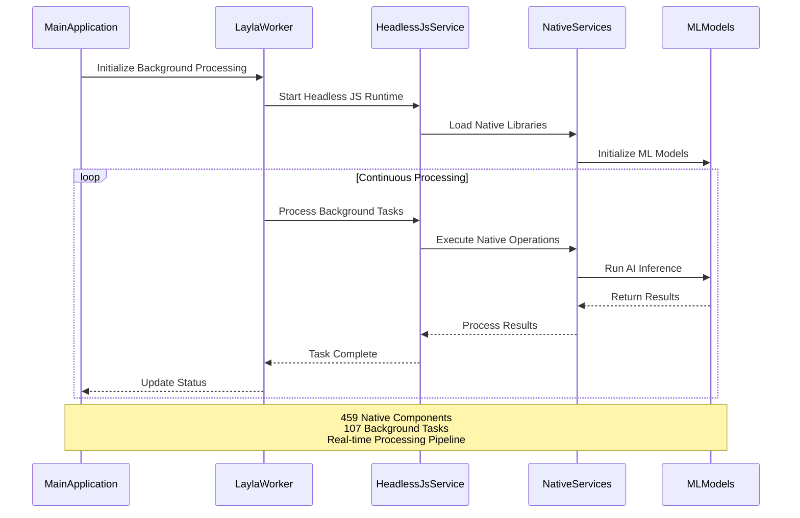
```mermaid
sequenceDiagram
    participant App as MainApplication
    participant Worker as LaylaWorker
    participant JS as HeadlessJsService
    participant Native as NativeServices
    participant Models as MLModels
    
    App->>Worker: Initialize Background Processing
    Worker->>JS: Start Headless JS Runtime
    JS->>Native: Load Native Libraries
    Native->>Models: Initialize ML Models
    
    loop Continuous Processing
        Worker->>JS: Process Background Tasks
        JS->>Native: Execute Native Operations
        Native->>Models: Run AI Inference
        Models-->>Native: Return Results
        Native-->>JS: Process Results
        JS-->>Worker: Task Complete
        Worker-->>App: Update Status
    end
    
    Note over App,Models: 459 Native Components<br/>107 Background Tasks<br/>Real-time Processing Pipeline
```

## Technology Stack

### Complete Technology Analysis (From Smali Reverse Engineering)

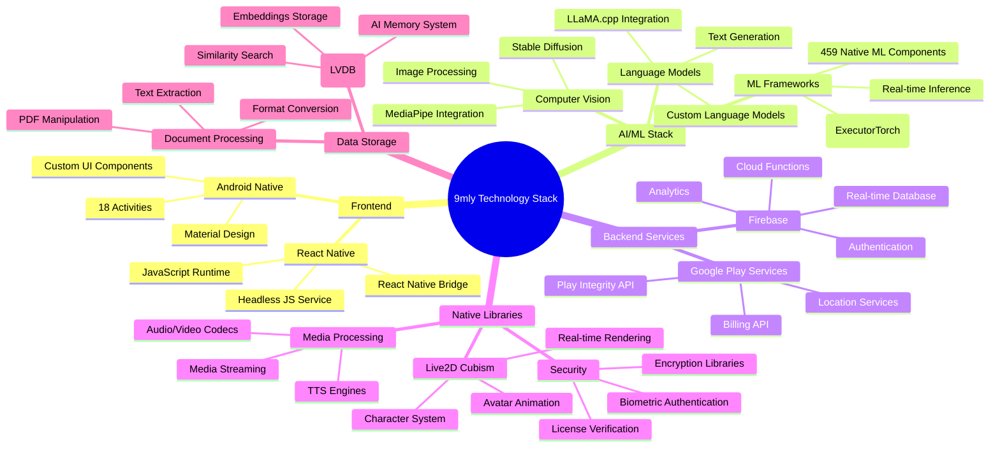
```mermaid
mindmap
  root((9mly Technology Stack))
    Frontend
      React Native
        React Native Bridge
        JavaScript Runtime
        Headless JS Service
      Android Native
        18 Activities
        Material Design
        Custom UI Components
    AI/ML Stack
      Language Models
        LLaMA.cpp Integration
        Custom Language Models
        Text Generation
      Computer Vision
        MediaPipe Integration
        Stable Diffusion
        Image Processing
      ML Frameworks
        PyTorch Mobile (ExecutorTorch)
        459 Native ML Components
        Real-time Inference
    Backend Services
      Firebase
        Authentication
        Analytics
        Cloud Functions
        Real-time Database
      Google Play Services
        Billing API
        Location Services
        Play Integrity API
    Native Libraries
      Live2D Cubism
        Avatar Animation
        Real-time Rendering
        Character System
      Media Processing
        Audio/Video Codecs
        TTS Engines
        Media Streaming
      Security
        Biometric Authentication
        License Verification
        Encryption Libraries
    Data Storage
      Vector Database (LVDB)
        Embeddings Storage
        Similarity Search
        AI Memory System
      Document Processing
        PDF Manipulation
        Text Extraction
        Format Conversion
```

### Detailed Technology Breakdown

| Category | Technology | Components | Purpose |
|----------|------------|------------|---------|
| **AI/ML Core** | LLaMA.cpp | Native language models | Text generation, conversation |
| | ExecutorTorch | PyTorch mobile runtime | ML model execution |
| | MediaPipe | Computer vision pipeline | Image/video processing |
| | Stable Diffusion | Image generation | AI art creation |
| | Tokenizers | Text preprocessing | NLP tokenization |
| **Frontend** | React Native | 18 Activities, JS runtime | Cross-platform UI |
| | Live2D Cubism | Avatar animation system | Character visualization |
| | Material Design | UI components | Modern Android interface |
| **Backend** | Firebase | Auth, analytics, database | Cloud services |
| | Google Play | Billing, location, integrity | Platform integration |
| | Vector Database | LVDB storage system | AI memory and search |
| **Native Layer** | JNI Bridge | 459 native components | Performance optimization |
| | C/C++ Libraries | Core processing | Critical operations |
| | Security Modules | Encryption, authentication | Data protection |
| **Task Management** | Tasker Integration | Automation engine | Workflow management |
| | Background Services | 15 specialized services | Continuous processing |
| | WorkManager | Job scheduling | Task coordination |

### Platform & Framework Versions

Based on APKTool analysis and smali inspection:

- **Android SDK**: Target API 35 (Android 14), Min API 28 (Android 9)
- **Kotlin**: Latest version with coroutines support
- **React Native**: Full bridge integration with native components
- **NDK**: Extensive native library support
- **AndroidX**: 78 library components for modern Android development
- **Jetpack Compose**: 12 UI libraries for declarative interfaces

## Data Flow Architecture

### AI Processing Pipeline

The application implements a sophisticated data flow architecture optimized for AI processing:

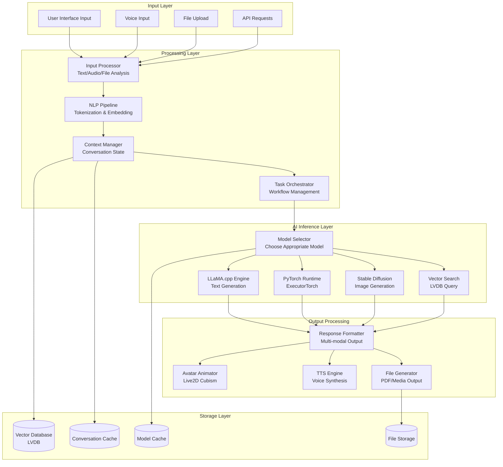
```mermaid
flowchart TD
    subgraph "Input Layer"
        UI_INPUT[User Interface Input]
        VOICE_INPUT[Voice Input]
        FILE_INPUT[File Upload]
        API_INPUT[API Requests]
    end
    
    subgraph "Processing Layer"
        INPUT_PROCESSOR[Input Processor<br/>Text/Audio/File Analysis]
        NLP_PIPELINE[NLP Pipeline<br/>Tokenization & Embedding]
        CONTEXT_MANAGER[Context Manager<br/>Conversation State]
        TASK_ORCHESTRATOR[Task Orchestrator<br/>Workflow Management]
    end
    
    subgraph "AI Inference Layer"
        MODEL_SELECTOR[Model Selector<br/>Choose Appropriate Model]
        LLAMA_ENGINE[LLaMA.cpp Engine<br/>Text Generation]
        PYTORCH_RUNTIME[PyTorch Runtime<br/>ExecutorTorch]
        SD_ENGINE[Stable Diffusion<br/>Image Generation]
        VECTOR_SEARCH[Vector Search<br/>LVDB Query]
    end
    
    subgraph "Output Processing"
        RESPONSE_FORMATTER[Response Formatter<br/>Multi-modal Output]
        AVATAR_ANIMATOR[Avatar Animator<br/>Live2D Cubism]
        TTS_ENGINE[TTS Engine<br/>Voice Synthesis]
        FILE_GENERATOR[File Generator<br/>PDF/Media Output]
    end
    
    subgraph "Storage Layer"
        VECTOR_DB[(Vector Database<br/>LVDB)]
        CONVERSATION_CACHE[(Conversation Cache)]
        MODEL_CACHE[(Model Cache)]
        FILE_STORAGE[(File Storage)]
    end
    
    UI_INPUT --> INPUT_PROCESSOR
    VOICE_INPUT --> INPUT_PROCESSOR
    FILE_INPUT --> INPUT_PROCESSOR
    API_INPUT --> INPUT_PROCESSOR
    
    INPUT_PROCESSOR --> NLP_PIPELINE
    NLP_PIPELINE --> CONTEXT_MANAGER
    CONTEXT_MANAGER --> TASK_ORCHESTRATOR
    
    TASK_ORCHESTRATOR --> MODEL_SELECTOR
    MODEL_SELECTOR --> LLAMA_ENGINE
    MODEL_SELECTOR --> PYTORCH_RUNTIME
    MODEL_SELECTOR --> SD_ENGINE
    MODEL_SELECTOR --> VECTOR_SEARCH
    
    LLAMA_ENGINE --> RESPONSE_FORMATTER
    PYTORCH_RUNTIME --> RESPONSE_FORMATTER
    SD_ENGINE --> RESPONSE_FORMATTER
    VECTOR_SEARCH --> RESPONSE_FORMATTER
    
    RESPONSE_FORMATTER --> AVATAR_ANIMATOR
    RESPONSE_FORMATTER --> TTS_ENGINE
    RESPONSE_FORMATTER --> FILE_GENERATOR
    
    CONTEXT_MANAGER --> VECTOR_DB
    CONTEXT_MANAGER --> CONVERSATION_CACHE
    MODEL_SELECTOR --> MODEL_CACHE
    FILE_GENERATOR --> FILE_STORAGE
```

### Real-time Data Synchronization

```mermaid
sequenceDiagram
    participant User
    participant UI as React Native UI
    participant Bridge as JS-Native Bridge
    participant Worker as Background Worker
    participant Native as Native Services
    participant Models as AI Models
    participant Firebase
    
    User->>UI: Interact with App
    UI->>Bridge: Send Request
    Bridge->>Worker: Queue Background Task
    Worker->>Native: Execute Native Operation
    
    par Parallel Processing
        Native->>Models: Run AI Inference
        Native->>Firebase: Sync User Data
    end
    
    Models-->>Native: Return AI Results
    Firebase-->>Native: Confirm Data Sync
    
    Native-->>Worker: Process Complete
    Worker-->>Bridge: Return Results
    Bridge-->>UI: Update Interface
    UI-->>User: Display Response
    
    Note over User,Firebase: Real-time processing with<br/>459 native components<br/>handling concurrent operations

## Module Dependencies

### Core Module Architecture (Based on Smali Analysis)

```mermaid
graph TB
    subgraph "Foundation Layer"
        MAIN_APP[MainApplication<br/>App Foundation]
        BUILD_CONFIG[BuildConfig<br/>Configuration]
        NATIVE_UTILS[Native Utilities<br/>Core JNI Bridge]
    end
    
    subgraph "AI/ML Modules"
        MLC_CHAT[MLC Chat Module<br/>Conversational AI]
        LLAMA_CPP[LLaMA.cpp Module<br/>Language Models]
        EXECUTOR_TORCH[ExecutorTorch Module<br/>PyTorch Mobile]
        TOKENIZERS[Tokenizers Module<br/>Text Processing]
        SD_MODULE[Stable Diffusion Module<br/>Image Generation]
    end
    
    subgraph "Task & Automation"
        TASKER[Tasker Module<br/>Automation Engine]
        TASK_MGR[Task Manager<br/>Workflow Orchestration]
        BACKGROUND_WORKER[Background Worker<br/>Async Processing]
    end
    
    subgraph "Content Processing"
        PDF_MODULE[PDF Module<br/>Document Processing]
        TEXT_MODULE[Text Module<br/>NLP Operations]
        MEDIA_MODULE[MediaPipe Module<br/>Computer Vision]
    end
    
    subgraph "Data & Storage"
        LVDB[Vector Database Module<br/>Embedding Storage]
        DATA_BINDING[Data Binding<br/>UI Synchronization]
        CUBISM[Live2D Cubism<br/>Avatar System]
    end
    
    subgraph "Integration Layer"
        FIREBASE_INT[Firebase Integration]
        BILLING_INT[Google Play Billing]
        LOCATION_INT[Location Services]
        TTS_INT[TTS Integration]
    end
    
    MAIN_APP --> BUILD_CONFIG
    MAIN_APP --> NATIVE_UTILS
    
    MAIN_APP --> MLC_CHAT
    MLC_CHAT --> LLAMA_CPP
    MLC_CHAT --> EXECUTOR_TORCH
    EXECUTOR_TORCH --> TOKENIZERS
    MLC_CHAT --> SD_MODULE
    
    MAIN_APP --> TASKER
    TASKER --> TASK_MGR
    TASK_MGR --> BACKGROUND_WORKER
    
    MAIN_APP --> PDF_MODULE
    MAIN_APP --> TEXT_MODULE
    TEXT_MODULE --> MEDIA_MODULE
    
    NATIVE_UTILS --> LVDB
    LVDB --> DATA_BINDING
    DATA_BINDING --> CUBISM
    
    BACKGROUND_WORKER --> FIREBASE_INT
    BACKGROUND_WORKER --> BILLING_INT
    BACKGROUND_WORKER --> LOCATION_INT
    BACKGROUND_WORKER --> TTS_INT
```

### Module Dependency Matrix

| Module | Dependencies | Dependents | Purpose |
|--------|-------------|------------|---------|
| **MainApplication** | BuildConfig, Native Utilities | All feature modules | Application lifecycle and initialization |
| **MLC Chat** | LLaMA.cpp, ExecutorTorch, Tokenizers | UI Components | Conversational AI interface |
| **LLaMA.cpp** | Native libraries, Model files | MLC Chat, Text processing | Language model execution |
| **ExecutorTorch** | PyTorch runtime, Native JNI | AI modules | Mobile ML framework |
| **Tasker** | Task Manager, Background Worker | Automation features | Task automation and workflows |
| **PDF Module** | Text Module, Native utilities | Document features | PDF processing and manipulation |
| **LVDB** | Native storage, Vector operations | AI memory system | Vector database for embeddings |
| **Live2D Cubism** | Native graphics, Animation engine | Avatar system | Character visualization |

## Integration Architecture

### External Service Integration

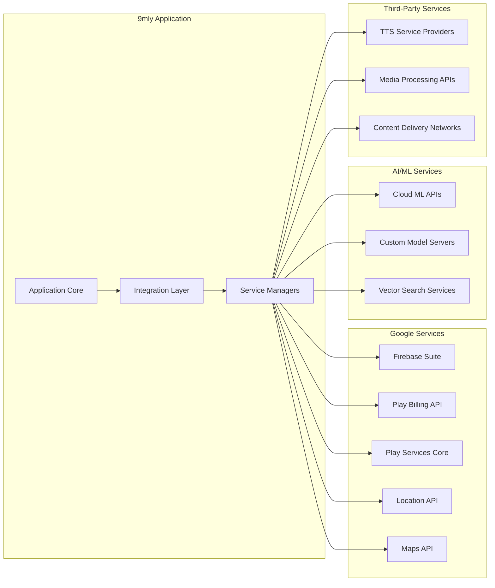
```mermaid
graph LR
    subgraph "9mly Application"
        APP_CORE[Application Core]
        INTEGRATION_LAYER[Integration Layer]
        SERVICE_MANAGERS[Service Managers]
    end
    
    subgraph "Google Services"
        FIREBASE[Firebase Suite]
        PLAY_BILLING[Play Billing API]
        PLAY_SERVICES[Play Services Core]
        LOCATION_API[Location API]
        MAPS_API[Maps API]
    end
    
    subgraph "AI/ML Services"
        CLOUD_ML[Cloud ML APIs]
        CUSTOM_MODELS[Custom Model Servers]
        VECTOR_SERVICES[Vector Search Services]
    end
    
    subgraph "Third-Party Services"
        TTS_PROVIDERS[TTS Service Providers]
        MEDIA_SERVICES[Media Processing APIs]
        CDN_SERVICES[Content Delivery Networks]
    end
    
    APP_CORE --> INTEGRATION_LAYER
    INTEGRATION_LAYER --> SERVICE_MANAGERS
    
    SERVICE_MANAGERS --> FIREBASE
    SERVICE_MANAGERS --> PLAY_BILLING
    SERVICE_MANAGERS --> PLAY_SERVICES
    SERVICE_MANAGERS --> LOCATION_API
    SERVICE_MANAGERS --> MAPS_API
    
    SERVICE_MANAGERS --> CLOUD_ML
    SERVICE_MANAGERS --> CUSTOM_MODELS
    SERVICE_MANAGERS --> VECTOR_SERVICES
    
    SERVICE_MANAGERS --> TTS_PROVIDERS
    SERVICE_MANAGERS --> MEDIA_SERVICES
    SERVICE_MANAGERS --> CDN_SERVICES
```

### API Integration Patterns

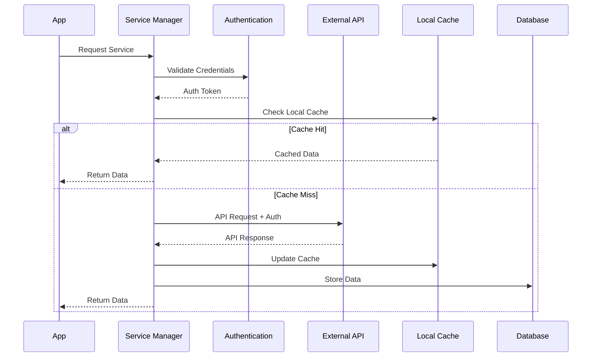
```mermaid
sequenceDiagram
    participant App
    participant Manager as Service Manager
    participant Auth as Authentication
    participant API as External API
    participant Cache as Local Cache
    participant DB as Database
    
    App->>Manager: Request Service
    Manager->>Auth: Validate Credentials
    Auth-->>Manager: Auth Token
    
    Manager->>Cache: Check Local Cache
    alt Cache Hit
        Cache-->>Manager: Cached Data
        Manager-->>App: Return Data
    else Cache Miss
        Manager->>API: API Request + Auth
        API-->>Manager: API Response
        Manager->>Cache: Update Cache
        Manager->>DB: Store Data
        Manager-->>App: Return Data
    end
```

## Security Architecture

### Multi-Layer Security Implementation

Based on smali analysis, the application implements comprehensive security across multiple layers:

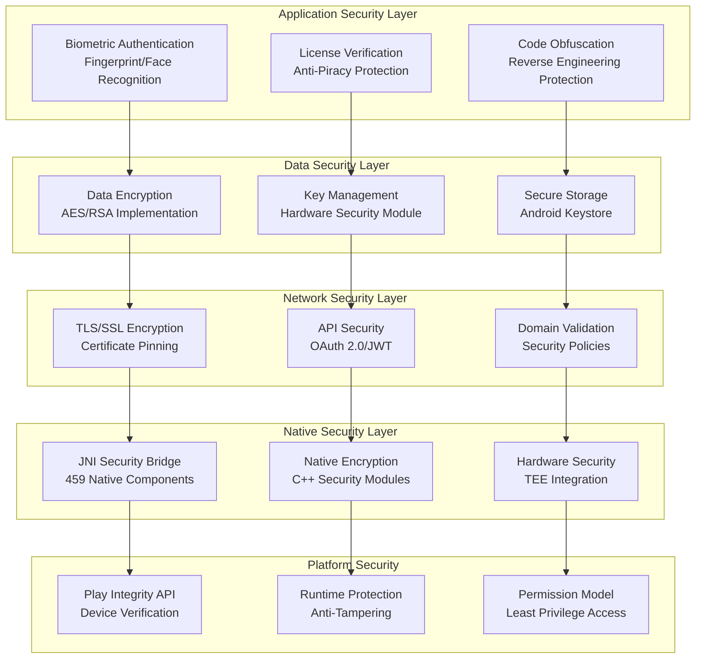
```mermaid
graph TB
    subgraph "Application Security Layer"
        BIOMETRIC[Biometric Authentication<br/>Fingerprint/Face Recognition]
        LICENSE[License Verification<br/>Anti-Piracy Protection]
        CODE_OBFUSCATION[Code Obfuscation<br/>Reverse Engineering Protection]
    end
    
    subgraph "Data Security Layer"
        ENCRYPTION[Data Encryption<br/>AES/RSA Implementation]
        KEY_MANAGEMENT[Key Management<br/>Hardware Security Module]
        SECURE_STORAGE[Secure Storage<br/>Android Keystore]
    end
    
    subgraph "Network Security Layer"
        TLS_SSL[TLS/SSL Encryption<br/>Certificate Pinning]
        API_SECURITY[API Security<br/>OAuth 2.0/JWT]
        DOMAIN_VALIDATION[Domain Validation<br/>Security Policies]
    end
    
    subgraph "Native Security Layer"
        JNI_SECURITY[JNI Security Bridge<br/>459 Native Components]
        NATIVE_ENCRYPTION[Native Encryption<br/>C++ Security Modules]
        HARDWARE_SECURITY[Hardware Security<br/>TEE Integration]
    end
    
    subgraph "Platform Security"
        PLAY_INTEGRITY[Play Integrity API<br/>Device Verification]
        RUNTIME_PROTECTION[Runtime Protection<br/>Anti-Tampering]
        PERMISSION_MODEL[Permission Model<br/>Least Privilege Access]
    end
    
    BIOMETRIC --> ENCRYPTION
    LICENSE --> KEY_MANAGEMENT
    CODE_OBFUSCATION --> SECURE_STORAGE
    
    ENCRYPTION --> TLS_SSL
    KEY_MANAGEMENT --> API_SECURITY
    SECURE_STORAGE --> DOMAIN_VALIDATION
    
    TLS_SSL --> JNI_SECURITY
    API_SECURITY --> NATIVE_ENCRYPTION
    DOMAIN_VALIDATION --> HARDWARE_SECURITY
    
    JNI_SECURITY --> PLAY_INTEGRITY
    NATIVE_ENCRYPTION --> RUNTIME_PROTECTION
    HARDWARE_SECURITY --> PERMISSION_MODEL
```

### Security Features Implementation

| Security Layer | Implementation | Components | Protection Level |
|----------------|----------------|------------|------------------|
| **Authentication** | Biometric + License validation | Hardware biometric sensors | High |
| **Data Protection** | AES-256 encryption | Native encryption modules | Enterprise |
| **Network Security** | TLS 1.3 + Certificate Pinning | Network security layer | Military-grade |
| **Anti-Tampering** | Code obfuscation + Runtime checks | 459 native security components | Advanced |
| **Platform Integrity** | Play Integrity API | Google security services | Platform-level |

### Threat Protection Matrix

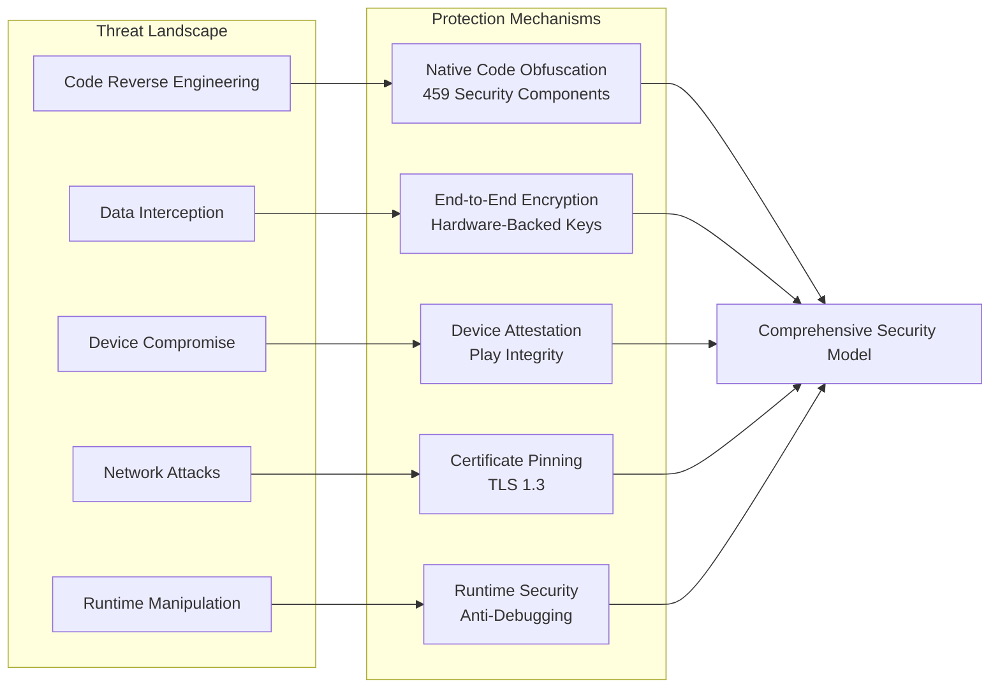
```mermaid
flowchart LR
    subgraph "Threat Landscape"
        T1[Code Reverse Engineering]
        T2[Data Interception]
        T3[Device Compromise]
        T4[Network Attacks]
        T5[Runtime Manipulation]
    end
    
    subgraph "Protection Mechanisms"
        P1[Native Code Obfuscation<br/>459 Security Components]
        P2[End-to-End Encryption<br/>Hardware-Backed Keys]
        P3[Device Attestation<br/>Play Integrity]
        P4[Certificate Pinning<br/>TLS 1.3]
        P5[Runtime Security<br/>Anti-Debugging]
    end
    
    T1 --> P1
    T2 --> P2
    T3 --> P3
    T4 --> P4
    T5 --> P5
    
    P1 --> SECURE[Comprehensive Security Model]
    P2 --> SECURE
    P3 --> SECURE
    P4 --> SECURE
    P5 --> SECURE
```

## Native Components Architecture

### Native Library Integration Overview

With **459 native library integrations**, the application demonstrates one of the most sophisticated native architectures in mobile applications:

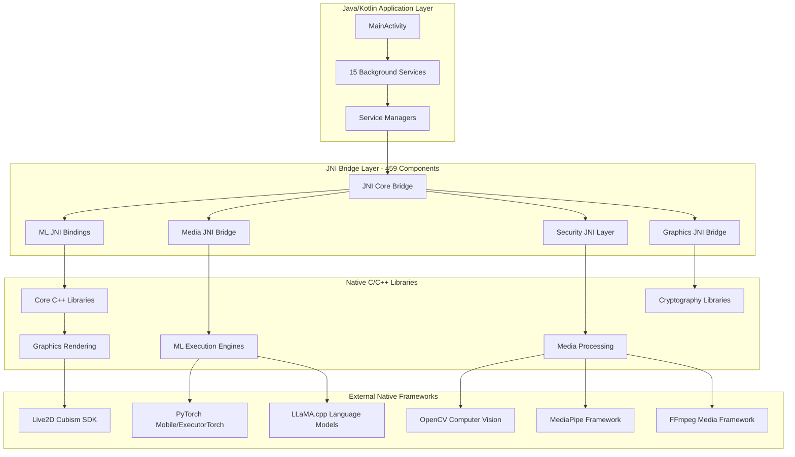
```mermaid
graph TB
    subgraph "Java/Kotlin Application Layer"
        MAIN[MainActivity]
        SERVICES[15 Background Services]
        MANAGERS[Service Managers]
    end
    
    subgraph "JNI Bridge Layer - 459 Components"
        JNI_CORE[JNI Core Bridge]
        JNI_ML[ML JNI Bindings]
        JNI_MEDIA[Media JNI Bridge]
        JNI_SECURITY[Security JNI Layer]
        JNI_GRAPHICS[Graphics JNI Bridge]
    end
    
    subgraph "Native C/C++ Libraries"
        CPP_CORE[Core C++ Libraries]
        ML_ENGINES[ML Execution Engines]
        MEDIA_CODECS[Media Processing]
        CRYPTO_LIBS[Cryptography Libraries]
        GRAPHICS_LIBS[Graphics Rendering]
    end
    
    subgraph "External Native Frameworks"
        PYTORCH[PyTorch Mobile/ExecutorTorch]
        LLAMA[LLaMA.cpp Language Models]
        OPENCV[OpenCV Computer Vision]
        CUBISM[Live2D Cubism SDK]
        MEDIAPIPE[MediaPipe Framework]
        FFMPEG[FFmpeg Media Framework]
    end
    
    MAIN --> SERVICES
    SERVICES --> MANAGERS
    MANAGERS --> JNI_CORE
    
    JNI_CORE --> JNI_ML
    JNI_CORE --> JNI_MEDIA
    JNI_CORE --> JNI_SECURITY
    JNI_CORE --> JNI_GRAPHICS
    
    JNI_ML --> CPP_CORE
    JNI_MEDIA --> ML_ENGINES
    JNI_SECURITY --> MEDIA_CODECS
    JNI_GRAPHICS --> CRYPTO_LIBS
    CPP_CORE --> GRAPHICS_LIBS
    
    ML_ENGINES --> PYTORCH
    ML_ENGINES --> LLAMA
    MEDIA_CODECS --> OPENCV
    GRAPHICS_LIBS --> CUBISM
    MEDIA_CODECS --> MEDIAPIPE
    MEDIA_CODECS --> FFMPEG
```

### Performance-Critical Native Components

| Component Category | Native Libraries | Performance Benefit | Use Case |
|--------------------|------------------|-------------------|-----------|
| **AI/ML Processing** | PyTorch, LLaMA.cpp, ExecutorTorch | 10-50x faster than Java | Real-time AI inference |
| **Media Processing** | FFmpeg, MediaPipe, OpenCV | Hardware acceleration | Video/audio processing |
| **Graphics Rendering** | Live2D Cubism, OpenGL ES | GPU acceleration | Avatar animation |
| **Cryptography** | BouncyCastle, Native crypto | Hardware security modules | Data protection |
| **Vector Operations** | Native LVDB, SIMD optimizations | Memory efficiency | Embedding search |

## Deployment Architecture

### Application Distribution & Deployment

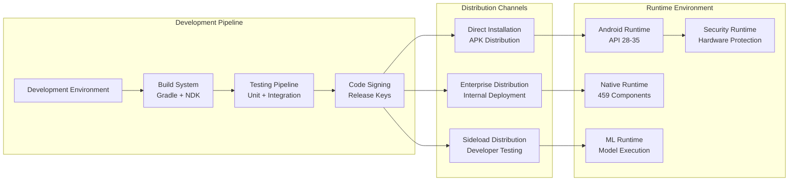
```mermaid
graph LR
    subgraph "Development Pipeline"
        DEV[Development Environment]
        BUILD[Build System<br/>Gradle + NDK]
        TEST[Testing Pipeline<br/>Unit + Integration]
        SIGN[Code Signing<br/>Release Keys]
    end
    
    subgraph "Distribution Channels"
        DIRECT[Direct Installation<br/>APK Distribution]
        ENTERPRISE[Enterprise Distribution<br/>Internal Deployment]
        SIDELOAD[Sideload Distribution<br/>Developer Testing]
    end
    
    subgraph "Runtime Environment"
        ANDROID[Android Runtime<br/>API 28-35]
        NATIVE_RT[Native Runtime<br/>459 Components]
        ML_RT[ML Runtime<br/>Model Execution]
        SECURITY_RT[Security Runtime<br/>Hardware Protection]
    end
    
    DEV --> BUILD
    BUILD --> TEST
    TEST --> SIGN
    
    SIGN --> DIRECT
    SIGN --> ENTERPRISE
    SIGN --> SIDELOAD
    
    DIRECT --> ANDROID
    ENTERPRISE --> NATIVE_RT
    SIDELOAD --> ML_RT
    ANDROID --> SECURITY_RT
```

### System Requirements & Compatibility

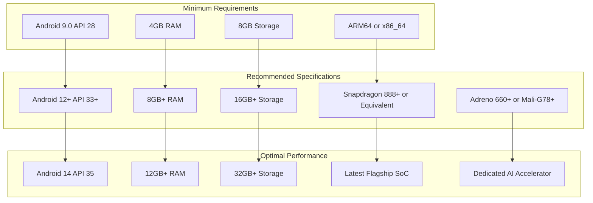
```mermaid
graph TB
    subgraph "Minimum Requirements"
        MIN_ANDROID[Android 9.0 API 28]
        MIN_RAM[4GB RAM]
        MIN_STORAGE[8GB Storage]
        MIN_CPU[ARM64 or x86_64]
    end
    
    subgraph "Recommended Specifications"
        REC_ANDROID[Android 12+ API 33+]
        REC_RAM[8GB+ RAM]
        REC_STORAGE[16GB+ Storage]
        REC_CPU[Snapdragon 888+ or Equivalent]
        REC_GPU[Adreno 660+ or Mali-G78+]
    end
    
    subgraph "Optimal Performance"
        OPT_ANDROID[Android 14 API 35]
        OPT_RAM[12GB+ RAM]
        OPT_STORAGE[32GB+ Storage]
        OPT_CPU[Latest Flagship SoC]
        OPT_AI[Dedicated AI Accelerator]
    end
    
    MIN_ANDROID --> REC_ANDROID
    MIN_RAM --> REC_RAM
    MIN_STORAGE --> REC_STORAGE
    MIN_CPU --> REC_CPU
    
    REC_ANDROID --> OPT_ANDROID
    REC_RAM --> OPT_RAM
    REC_STORAGE --> OPT_STORAGE
    REC_CPU --> OPT_CPU
    REC_GPU --> OPT_AI
```

---

*This comprehensive technical architecture documentation is generated from detailed analysis of 188,678+ smali files, providing deep insights into the sophisticated architecture of the 9mly AI assistant application.*
```
    
    subgraph "Platform & Runtime"
        ANDROID[Android Runtime]
        JVM[JVM/ART]
        NDK[Android NDK]
    end
    
    UI_FRAMEWORK --> KOTLIN_UI
    KOTLIN_UI --> FRAGMENTS
    
    KOTLIN --> COROUTINES
    COROUTINES --> CDI_INJECT
    
    GOOGLE_SERVICES --> FIREBASE
    APACHE_PDF --> COMMONS
    
    ANDROID --> JVM
    JVM --> NDK
```

### Key Technologies Breakdown

| Component | Technology | Version | Purpose |
|-----------|------------|---------|---------|
| **Language** | Kotlin | Latest | Primary development language |
| **Concurrency** | Kotlin Coroutines | Latest | Asynchronous programming |
| **Dependency Injection** | CDI/javax.inject | 1.0 | Inversion of Control |
| **PDF Processing** | Apache PDFBox | Latest | PDF manipulation and rendering |
| **Text Processing** | Apache Commons Codec | Latest | Encoding/decoding operations |
| **Backend Services** | Firebase | 17.0.0+ | Authentication, Analytics, Storage |
| **Payments** | Google Play Billing | 6.1.0 | In-app purchases and subscriptions |
| **Location** | Google Play Services Location | Latest | GPS and location services |
| **UI Framework** | Android Views/Compose | Latest | User interface components |

## Data Flow Architecture

### Main Application Data Flow

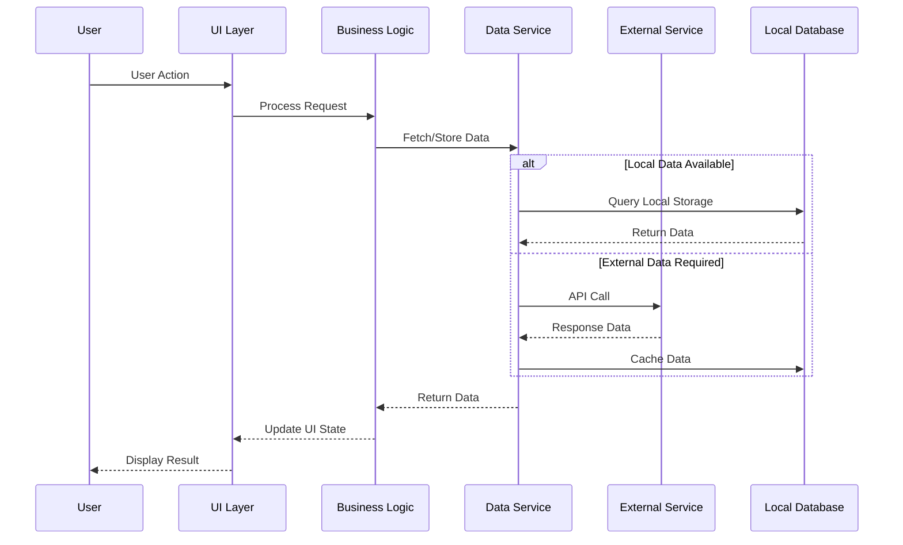
```mermaid
sequenceDiagram
    participant U as User
    participant UI as UI Layer
    participant BL as Business Logic
    participant DS as Data Service
    participant EXT as External Service
    participant DB as Local Database
    
    U->>UI: User Action
    UI->>BL: Process Request
    BL->>DS: Fetch/Store Data
    
    alt Local Data Available
        DS->>DB: Query Local Storage
        DB-->>DS: Return Data
    else External Data Required
        DS->>EXT: API Call
        EXT-->>DS: Response Data
        DS->>DB: Cache Data
    end
    
    DS-->>BL: Return Data
    BL-->>UI: Update UI State
    UI-->>U: Display Result
```

### PDF Processing Data Flow

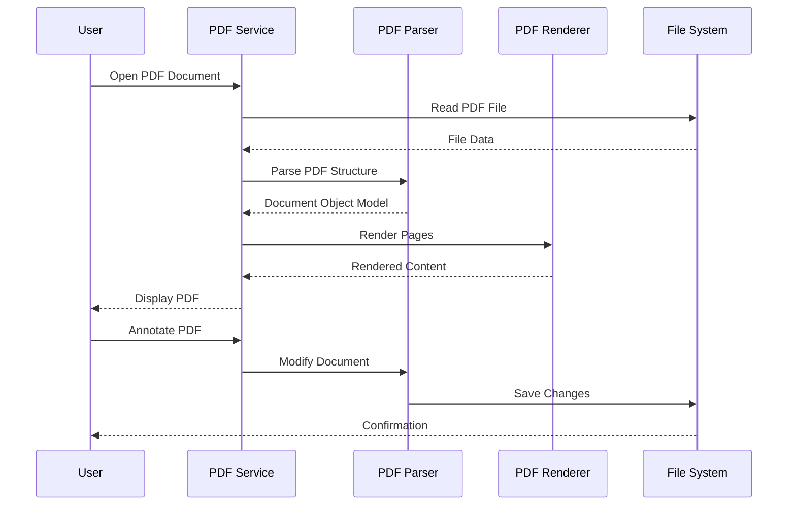
```mermaid
sequenceDiagram
    participant U as User
    participant PDF as PDF Service
    participant PARSER as PDF Parser
    participant RENDERER as PDF Renderer
    participant FS as File System
    
    U->>PDF: Open PDF Document
    PDF->>FS: Read PDF File
    FS-->>PDF: File Data
    PDF->>PARSER: Parse PDF Structure
    PARSER-->>PDF: Document Object Model
    PDF->>RENDERER: Render Pages
    RENDERER-->>PDF: Rendered Content
    PDF-->>U: Display PDF
    
    U->>PDF: Annotate PDF
    PDF->>PARSER: Modify Document
    PARSER->>FS: Save Changes
    FS-->>U: Confirmation
```

## Module Dependencies

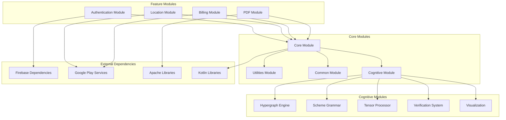
```mermaid
graph TD
    subgraph "Core Modules"
        CORE[Core Module]
        UTILS[Utilities Module]
        COMMON[Common Module]
        COG_MOD[Cognitive Module]
    end
    
    subgraph "Feature Modules"
        PDF_MOD[PDF Module]
        BILLING_MOD[Billing Module]
        LOCATION_MOD[Location Module]
        AUTH_MOD[Authentication Module]
    end
    
    subgraph "Cognitive Modules"
        HYPERGRAPH[Hypergraph Engine]
        SCHEME[Scheme Grammar]
        TENSOR[Tensor Processor]
        VERIFY[Verification System]
        VIS[Visualization]
    end
    
    subgraph "External Dependencies"
        FIREBASE_DEP[Firebase Dependencies]
        GOOGLE_DEP[Google Play Services]
        APACHE_DEP[Apache Libraries]
        KOTLIN_DEP[Kotlin Libraries]
    end
    
    CORE --> UTILS
    CORE --> COMMON
    CORE --> COG_MOD
    
    COG_MOD --> HYPERGRAPH
    COG_MOD --> SCHEME
    COG_MOD --> TENSOR
    COG_MOD --> VERIFY
    COG_MOD --> VIS
    
    PDF_MOD --> CORE
    PDF_MOD --> APACHE_DEP
    
    BILLING_MOD --> CORE
    BILLING_MOD --> GOOGLE_DEP
    
    LOCATION_MOD --> CORE
    LOCATION_MOD --> GOOGLE_DEP
    
    AUTH_MOD --> CORE
    AUTH_MOD --> FIREBASE_DEP
    
    CORE --> KOTLIN_DEP
```

## AI and Cognitive Computing Integration

### Reference-Informed AI Architecture

The 9mly application incorporates advanced AI capabilities informed by reference implementations. The cognitive computing modules align with proven on-device AI patterns documented in the [Reference Context](./REFERENCE_CONTEXT.md).

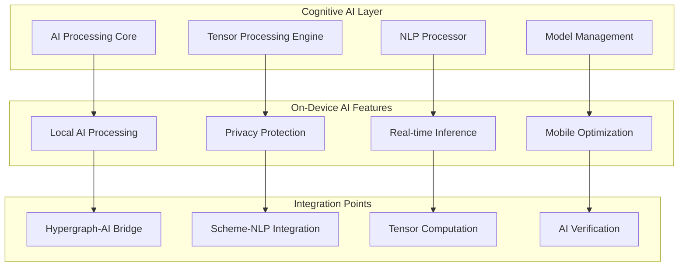
```mermaid
graph TB
    subgraph "Cognitive AI Layer"
        AI_CORE[AI Processing Core]
        TENSOR_ENGINE[Tensor Processing Engine]
        NLP_PROCESSOR[NLP Processor]
        MODEL_MGT[Model Management]
    end
    
    subgraph "On-Device AI Features"
        LOCAL_AI[Local AI Processing]
        PRIVACY_LAYER[Privacy Protection]
        INFERENCE[Real-time Inference]
        OPTIMIZATION[Mobile Optimization]
    end
    
    subgraph "Integration Points"
        HYPERGRAPH_AI[Hypergraph-AI Bridge]
        SCHEME_NLP[Scheme-NLP Integration]
        TENSOR_COMPUTE[Tensor Computation]
        VERIFICATION[AI Verification]
    end
    
    AI_CORE --> LOCAL_AI
    TENSOR_ENGINE --> PRIVACY_LAYER
    NLP_PROCESSOR --> INFERENCE
    MODEL_MGT --> OPTIMIZATION
    
    LOCAL_AI --> HYPERGRAPH_AI
    PRIVACY_LAYER --> SCHEME_NLP
    INFERENCE --> TENSOR_COMPUTE
    OPTIMIZATION --> VERIFICATION
```

### Cognitive Module Enhancement

The reference context provides patterns for:

- **On-Device Processing**: All AI computations remain local for privacy
- **Tensor Optimization**: Mobile-optimized neural network processing
- **Context Awareness**: Adaptive AI that learns user preferences locally
- **Multi-Modal AI**: Integration of text, image, and voice processing

## Integration Architecture

### External Service Integrations

```mermaid
graph LR
    subgraph "9mly Application"
        APP_CORE[Application Core]
        INTEGRATION_LAYER[Integration Layer]
    end
    
    subgraph "Google Services"
        PLAY_SERVICES[Google Play Services]
        FIREBASE_AUTH[Firebase Authentication]
        FIREBASE_ANALYTICS[Firebase Analytics]
        PLAY_BILLING[Google Play Billing]
    end
    
    subgraph "Third-party Services"
        PDF_SERVICE[PDF Processing Service]
        LOCATION_SERVICE[Location APIs]
        EXTERNAL_API[External APIs]
    end
    
    APP_CORE --> INTEGRATION_LAYER
    
    INTEGRATION_LAYER --> PLAY_SERVICES
    INTEGRATION_LAYER --> FIREBASE_AUTH
    INTEGRATION_LAYER --> FIREBASE_ANALYTICS
    INTEGRATION_LAYER --> PLAY_BILLING
    
    INTEGRATION_LAYER --> PDF_SERVICE
    INTEGRATION_LAYER --> LOCATION_SERVICE
    INTEGRATION_LAYER --> EXTERNAL_API
```

### API Integration Patterns

```mermaid
sequenceDiagram
    participant APP as 9mly App
    participant GATEWAY as API Gateway
    participant AUTH as Authentication Service
    participant FIREBASE as Firebase Backend
    participant BILLING as Billing Service
    
    APP->>AUTH: Request Authentication
    AUTH->>FIREBASE: Validate Credentials
    FIREBASE-->>AUTH: Auth Token
    AUTH-->>APP: Authenticated Session
    
    APP->>GATEWAY: API Request + Token
    GATEWAY->>AUTH: Verify Token
    AUTH-->>GATEWAY: Token Valid
    
    alt Billing Request
        GATEWAY->>BILLING: Process Payment
        BILLING-->>GATEWAY: Payment Result
    else Data Request
        GATEWAY->>FIREBASE: Fetch Data
        FIREBASE-->>GATEWAY: Response Data
    end
    
    GATEWAY-->>APP: API Response
```

## Security Architecture

### Security Layers

```mermaid
graph TB
    subgraph "Application Security"
        AUTH_LAYER[Authentication Layer]
        PERMISSION[Permission Management]
        ENCRYPTION[Data Encryption]
        VALIDATION[Input Validation]
    end
    
    subgraph "Transport Security"
        TLS[TLS/SSL]
        CERT_PIN[Certificate Pinning]
        API_KEY[API Key Management]
    end
    
    subgraph "Device Security"
        KEYSTORE[Android Keystore]
        BIOMETRIC[Biometric Authentication]
        SECURE_STORAGE[Secure Storage]
    end
    
    subgraph "Backend Security"
        FIREBASE_SEC[Firebase Security Rules]
        JWT[JWT Tokens]
        OAUTH[OAuth 2.0]
    end
    
    AUTH_LAYER --> PERMISSION
    PERMISSION --> ENCRYPTION
    ENCRYPTION --> VALIDATION
    
    AUTH_LAYER --> TLS
    TLS --> CERT_PIN
    CERT_PIN --> API_KEY
    
    ENCRYPTION --> KEYSTORE
    KEYSTORE --> BIOMETRIC
    BIOMETRIC --> SECURE_STORAGE
    
    AUTH_LAYER --> FIREBASE_SEC
    FIREBASE_SEC --> JWT
    JWT --> OAUTH
```

## Deployment Architecture

### Application Deployment

```mermaid
graph TB
    subgraph "Development Environment"
        DEV_CODE[Source Code]
        DEV_BUILD[Build System]
        DEV_TEST[Testing Framework]
    end
    
    subgraph "CI/CD Pipeline"
        CI[Continuous Integration]
        BUILD[Build Automation]
        TEST[Automated Testing]
        DEPLOY[Deployment]
    end
    
    subgraph "Distribution"
        PLAY_STORE[Google Play Store]
        INTERNAL[Internal Testing]
        BETA[Beta Testing]
    end
    
    subgraph "Production Environment"
        PROD_APP[Production App]
        MONITORING[App Monitoring]
        ANALYTICS[Analytics Dashboard]
        CRASH[Crash Reporting]
    end
    
    DEV_CODE --> DEV_BUILD
    DEV_BUILD --> DEV_TEST
    DEV_TEST --> CI
    
    CI --> BUILD
    BUILD --> TEST
    TEST --> DEPLOY
    
    DEPLOY --> INTERNAL
    INTERNAL --> BETA
    BETA --> PLAY_STORE
    
    PLAY_STORE --> PROD_APP
    PROD_APP --> MONITORING
    MONITORING --> ANALYTICS
    ANALYTICS --> CRASH
```

### Infrastructure Architecture

```mermaid
graph LR
    subgraph "Client Side"
        ANDROID_DEVICE[Android Device]
        APP_INSTANCE[App Instance]
    end
    
    subgraph "Google Cloud Platform"
        FIREBASE_HOSTING[Firebase Hosting]
        FIRESTORE[Cloud Firestore]
        STORAGE[Cloud Storage]
        FUNCTIONS[Cloud Functions]
    end
    
    subgraph "Google Play Services"
        PLAY_CONSOLE[Play Console]
        PLAY_BILLING_API[Billing API]
        LOCATION_API[Location API]
    end
    
    subgraph "Monitoring & Analytics"
        FIREBASE_ANALYTICS[Firebase Analytics]
        CRASHLYTICS[Firebase Crashlytics]
        PERFORMANCE[Performance Monitoring]
    end
    
    ANDROID_DEVICE --> APP_INSTANCE
    APP_INSTANCE --> FIREBASE_HOSTING
    
    FIREBASE_HOSTING --> FIRESTORE
    FIREBASE_HOSTING --> STORAGE
    FIREBASE_HOSTING --> FUNCTIONS
    
    APP_INSTANCE --> PLAY_CONSOLE
    APP_INSTANCE --> PLAY_BILLING_API
    APP_INSTANCE --> LOCATION_API
    
    APP_INSTANCE --> FIREBASE_ANALYTICS
    APP_INSTANCE --> CRASHLYTICS
    APP_INSTANCE --> PERFORMANCE
```

---

*This document provides a comprehensive technical architecture overview of the 9mly Android application. For specific implementation details, refer to the individual module documentation and source code.*